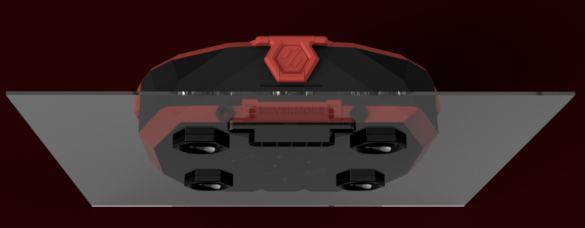

# Direct-mount a Stealthmax onto any panel!

* Don't have a Voron back panel cutout?
* Want to be able to install a Stealthmax on any surface?
* Don't want to order custom laser cut panels and be able to mod the panels easily DIY style?
* Try these modded files. They replace the files with the same numbers from the regular STL directory. 

## Things to buy to mod your panel of choice)?
- A **[40mm hole saw](https://s.click.aliexpress.com/e/_oEo5amR)** drill (and a drill)
- A **[3mm drill bit](https://s.click.aliexpress.com/e/_onEwfxl)** (and a drill). A 2mm one to pre-drill for the hole saw can help but not an absolute prerequisite.

## Quick Guide
* The new 2-Flow chamber comes with print-in-place drill-aims! You can not miss! You dont need to be able to measure with sub-mm precision. Just put the Flow Chamber on the panel, tape it down where it should be; point and...
* Drill EIGHT (8) 3mm holes using the flow chamber piece itself as your printed drill guide!
* Where? Five holes where the 40mm cutouts will be, those are hard to miss. The remaining three holes are located _around the center 40mm exhaust cutout_ going all the way through the Flow Chamber. Just poke your 3mm drill through those 3.4mm holes and drill through into the panel underneath. Dont worry about expanding the printed holes slightly, it wont matter.
* Once you have 8 holes in the exact right spots, remove the Flow Chamber, attach the 40mm hole saw to your drill and drill out the five (5) 40mm holes through the panel that will serve as air intakes/exhaust as well as mounting screws.
* Now your set! Check that the printed 40mm screws will fit through those large holes you just drilled (and cover any rough edges at the same time). If so, its basically assembly as usual, you just mount it differently.

  **Note** - compared to the regular BOM, this variant **adds a heat insert** on the back side below the center exhaust, and requires **an additional m3x10** (or 12, but then the main chamber side corresponding bolts needs to be 10mm instead of 12). The two 25mm m3 bolts that usually mounts the stealthmax to an extrusion will likely be a tad short (only 2mm will extend through a 3mm panel, on to which **28mm bolts** would be more suitable. I would shorten a m3x30, or use the 3mm drill again to make sure two m3x30 doesnt bottom out in the in-chamber-exhaust piece.
