# Back Panel Mount (BPM) Smart Electronics Preparation

These are instructions for the StealthMax (300) Smart Back Panel Mount (BPM). The majority of this part is borrowed from the DOPM documentation but with replaced images for continuity.

## Parts Required

Printed parts:
- 1x [1.4a_CableEntryCap_M8Barrel.stl](../../STLs/1_FlowChamber/1.4a_CableEntryCap_M8Barrel.stl)

Hardware:
- Raspberry Pi Pico W
- Female Dupont pins
- Male JST-PH 2.0 pins
- 1x M8 threaded DC connector
- 1x Matek Systems MBEC6S/MBEC2A
- 2x BME280
- 2x SGP40/SGP30
- 3x right angle 4-pin male header
- 1x right angle 5-pin male header
- 2x straight 4-pin male header
- 5x 4-pin female DuPont connector housing
- 1x 4-pin JST-PH 2.0 male pin/female connector housing

Tools:
- DuPont crimping tool
- JST crimping tool

## Back Panel Mount (BPM) Smart Electronics Preparation

1. With the Raspberry Pi Pico W accessible, start by flashing the latest controller firmware on it according to the [Nevermore Controller Setup Guide](https://github.com/SanaaHamel/nevermore-controller#guide-setup). In short:
   - Download the latest Nevermore Controller uf2 binary.
   - Connect the Raspberry Pi Pico W via USB Micro to a computer while holding down the BOOTSEL button.
   - Copy the downloaded .uf2 binary to the RPI-RP2 drive.
     - The Raspberry Pi Pico W will automatically reboot afterward.
   - SSH into your printer's Klipper host (e.g. a regular Raspberry Pi).
   - Install the Nevermore Controller Klipper module.
     - Restart your Klipper host if you enabled Bluetooth during the installation process.
   - Add the [minimal example configuration](https://github.com/SanaaHamel/nevermore-controller#klipper-config-minimal) to your printer.cfg.
   - We'll add the Nevermore macros from the Nevermore Controller Setup Guide to the relevant print start/end macros, and calibrate the sensors at a later stage.

1. Remove the nut from the M8 threaded DC connector and solder 75mm red and black 24 AWG wires to it. Apply a small section of heat shrink tubing to both leads, then slide the cables through the [1.4a_CableEntryCap_M8Barrel.stl](/STLs/1_FlowChamber/1.4a_CableEntryCap_M8Barrel.stl) and thread in the M8 threaded DC connector securely. Adding heatshrink over the soldered joints would be a good idea at this point.
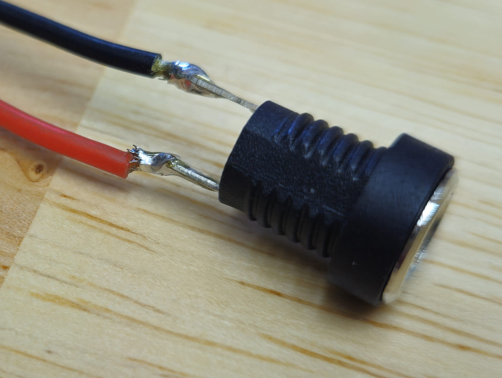
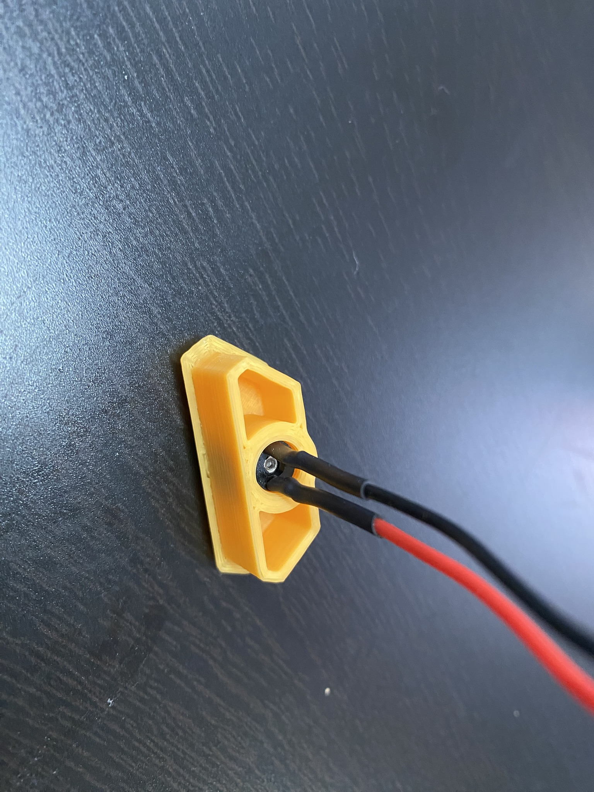

1. Solder a right angle 4-pin male header to the Matek Systems MBEC6S/MBEC2A buck converter.
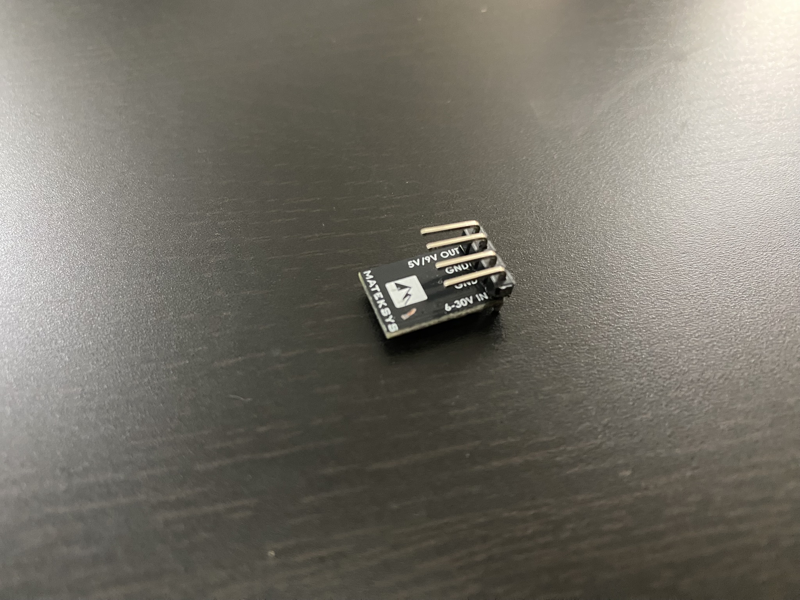
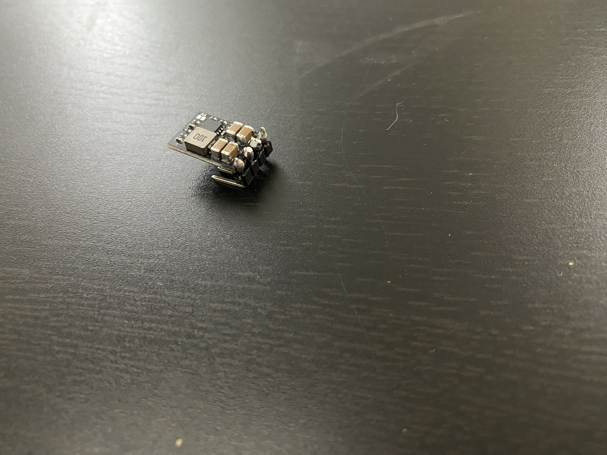

1. Solder the straight 4-pin male header to each of the BME280 PCBs.
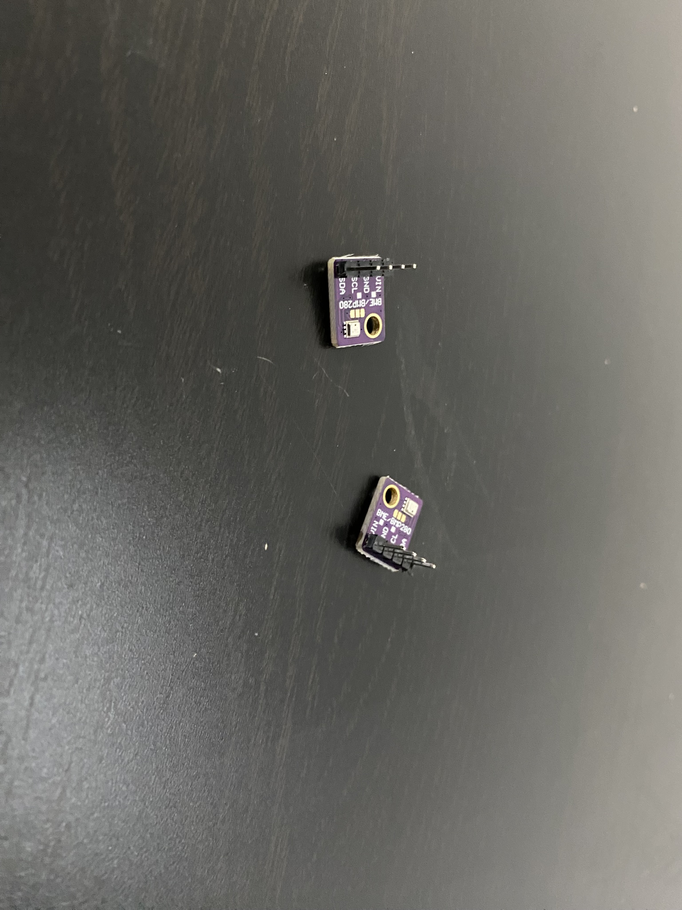

1. Add the SGP40/SGP30 PCBs on top of each of the pins soldered to the BME280 PCBs and solder it from the other side. Take extra care to not leave excess solder here, as it may interfere with the DuPont connector later.
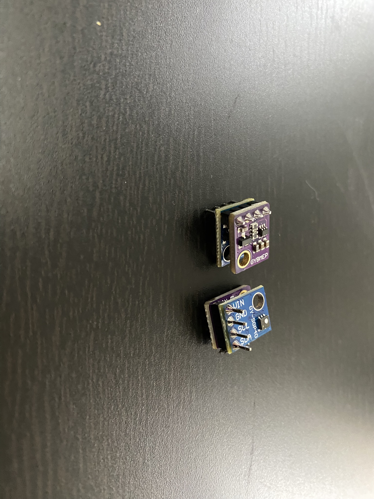
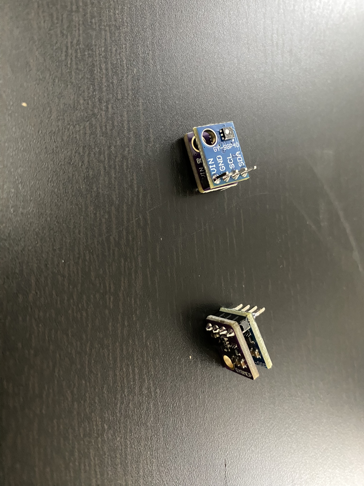

1. Solder 2x right angle 4-pin male header and 1x right angle 5-pin male header to the Raspberry Pi Pico W.
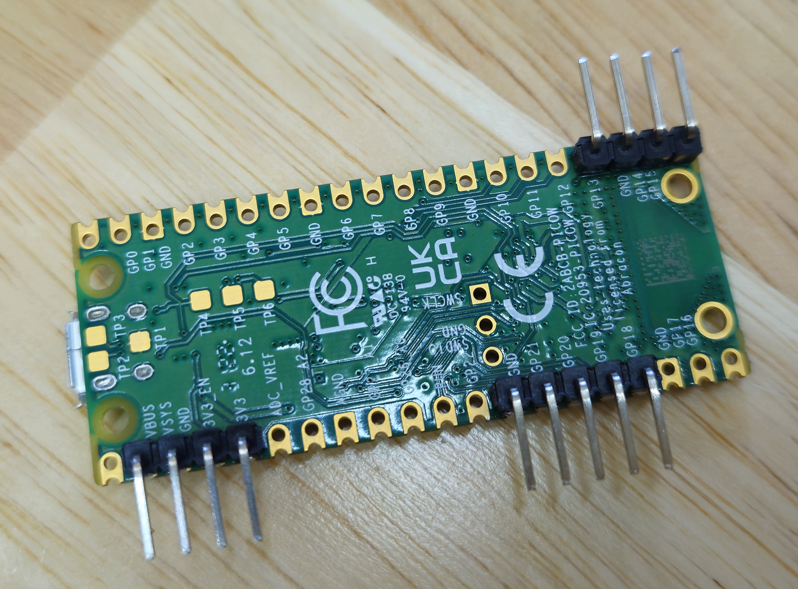

1. Crimp 4 DuPont female pins to the 325mm yellow, pink, black, and green 26 AWG wires. Insert the crimped wires into a 4-pin DuPont connector housing.
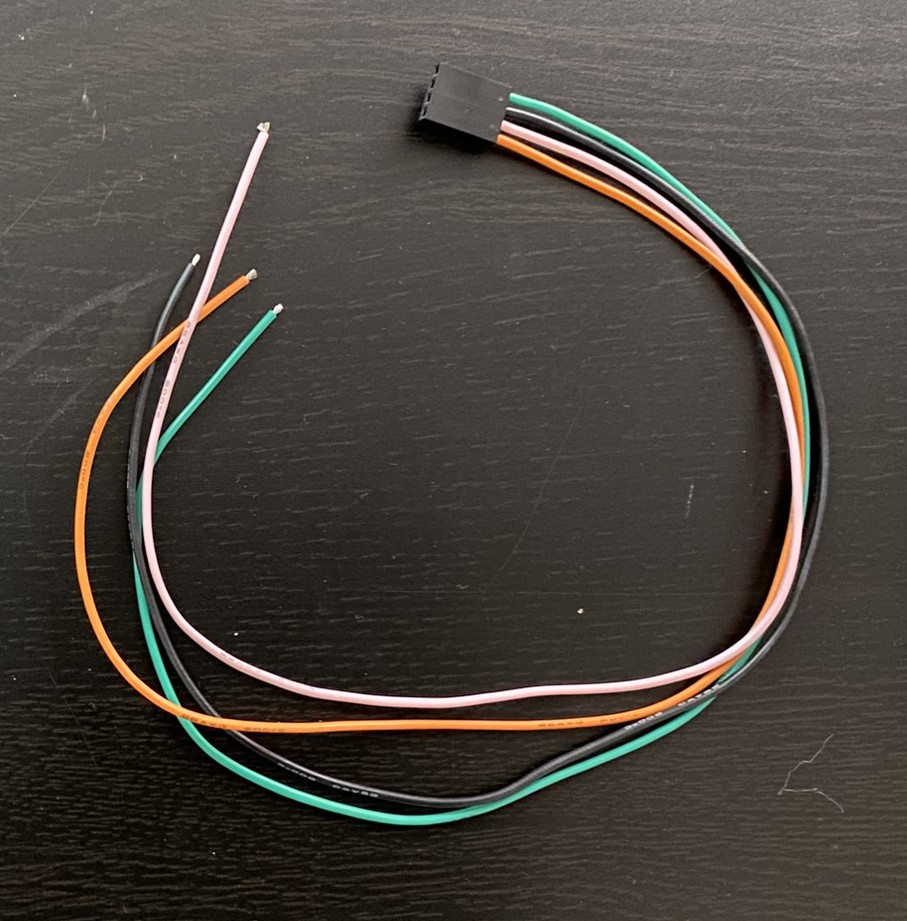

1. Crimp 4 DuPont female pins to the 300mm blue, gray, black, and green 26 AWG wires. Insert the crimped wires into a 4-pin DuPont connector housing.
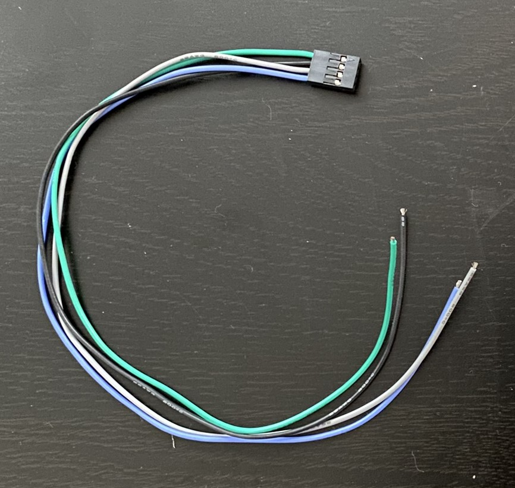

1. Crimp 2 DuPont female pins to the other end of the blue and gray wires from step 7, and yellow and pink wires from step 8. Do not crimp the black and green wires yet on either cable harness.
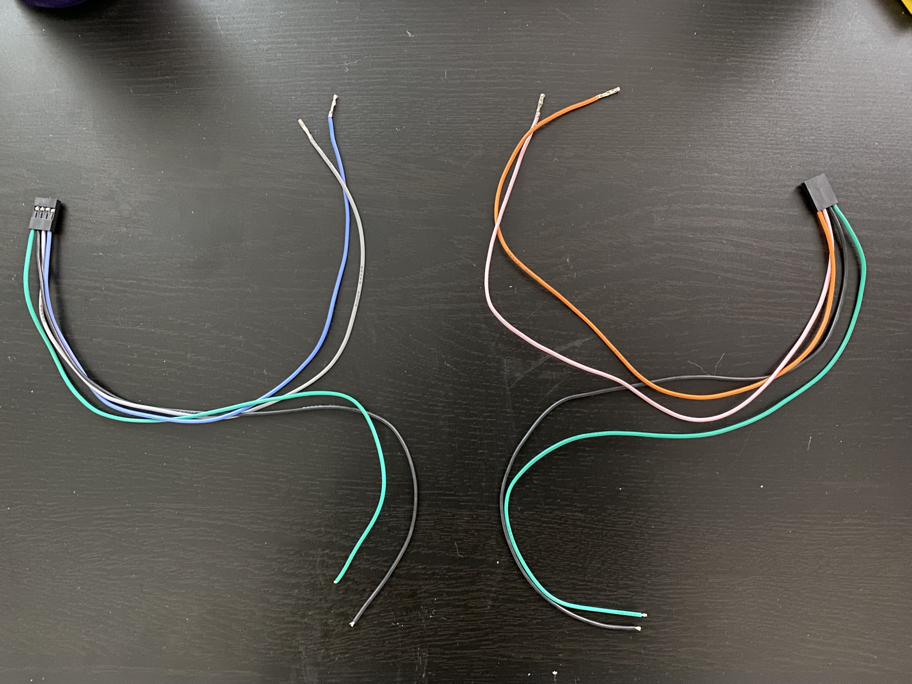

1.  Crimp 2 DuPont female pins to the 100mm violet and brown 26 AWG wires.
2.  Crimp 4 JST-PH 2.0 male pins to the 100mm violet and brown 26 AWG wires, and 200mm black and red 24 AWG wires. Insert the crimped violet and brown wires into a 4-pin DuPont connector housing, and the crimped violet, brown, red, and black wires into a 4-pin JST-PH 2.0 connector housing. There is a good example of this in the DOPM guide.
    - If you do not have JST-PH 2.0 male pins/female housing, solder the violet, brown, red, and black wires directly to a JST-PH 2.0 male housing, or a pre-crimped JST-PH 2.0 male pins/female housing assembly. If soldering, heatshrink is recommended to prevent shorts. (This is what this guide will show)

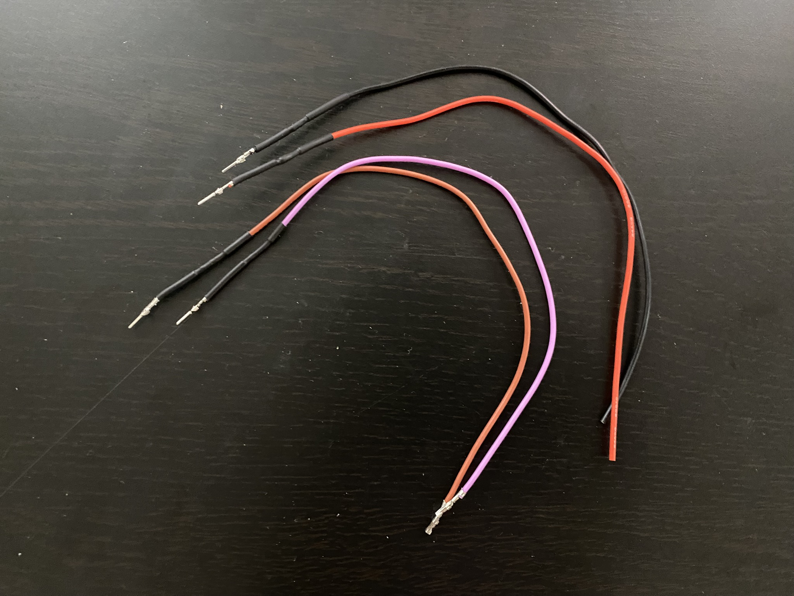
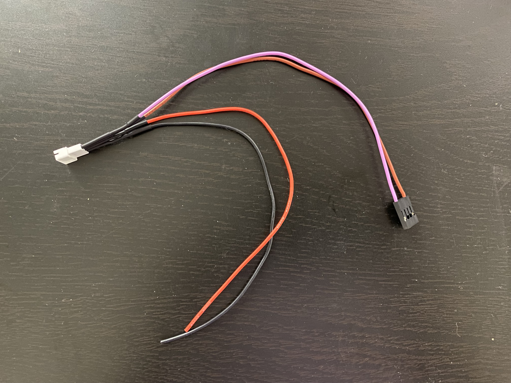

1.  Crimp 2 DuPont female pins to the red and black wires from step 11 and the red and black wires from step 2. Two wires into one DuPont pin is a tight fit, but it can be done with some patience.

1.  Insert the double-crimped red and black wires into a 4-pin DuPont connector housing.
    
1.  4 DuPont female pins to the 50mm red and black 24 AWG wires (both ends). Insert the crimped wires into a 4-pin DuPont connector housing and the other ends into the remaining slots of the DuPont connector housing of step 13. 
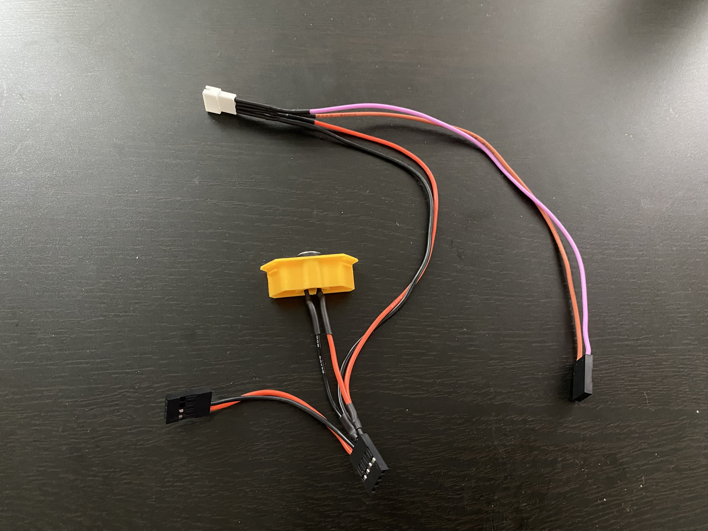

[Next: Back Panel Mount (BPM) Flow Chamber Assembly >](BPM_Flow_Chamber_Assembly.md)