# Back Panel Mount (BPM) Flow Chamber Assembly

These are instructions for the StealthMax (300) Smart Back Panel Mount (BPM).

## Parts Required

Printed parts:
- 1x [M_1b.0_FlowChamber_DOPM.stl](/STLs/1_FlowChamber/1b_DirectOnPanelMount/StealthMax/M_1b.0_FlowChamber_DOPM.stl)
- 4x [1.6_PCBSpacer.stl](/STLs/1_FlowChamber/1.6_PCBSpacer.stl)
- 1x [M_1b.1_RemovableAirDuct_DOPM.stl](/STLs/1_FlowChamber/1b_DirectOnPanelMount/StealthMax/M_1b.1_RemovableAirDuct_DOPM.stl)
- 1x [1.2_AirExhaustSlider.stl](/STLs/1_FlowChamber/1.2_AirExhaustSlider.stl)
- Optional: 1x [1.5_FanWirePin_Spare.stl](/STLs/1_FlowChamber/1.5_FanWirePin_Spare.stl)

Hardware:
- Raspberry Pi Pico W
- Female Dupont pins
- 1x 5-pin female DuPont connector housing
- 1x Delta BFB0712HF (fan)
- 1x M3x10 (or M3x8) BHCS
- 3x M2x4 FHCS

## Direct On Panel Mount (DOPM) Smart Electronics

1. Route the power harness from preparation step 14 through the [M_1b.0_FlowChamber_DOPM.stl](/STLs/1_FlowChamber/1b_DirectOnPanelMount/StealthMax/M_1b.0_FlowChamber_DOPM.stl) as follows, and connect the Matek Systems MBEC6S/MBEC2A buck converter.
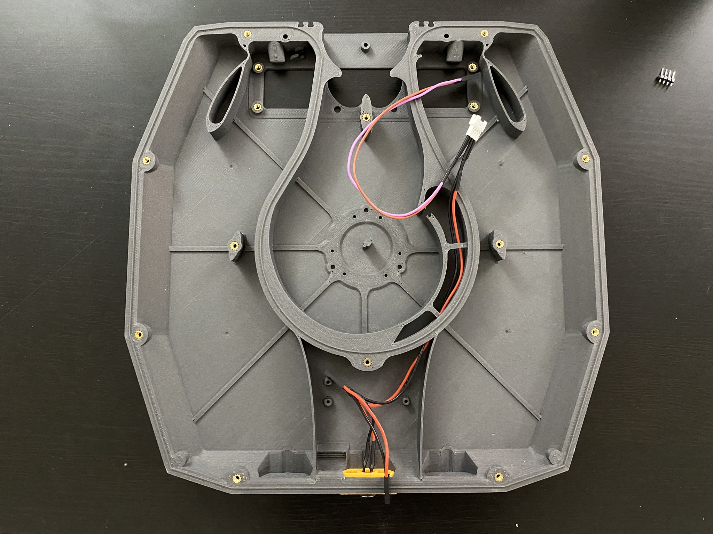

2. Push in the [1.4a_CableEntryCap_M8Barrel.stl](/STLs/1_FlowChamber/1.4a_CableEntryCap_M8Barrel.stl) into the slot.
   - If the cable entry cap doesn't push in easily, carefully shave off 0.3-0.5mm of plastic from the [M_1b.0_FlowChamber_DOPM.stl](/STLs/1_FlowChamber/1b_DirectOnPanelMount/StealthMax/M_1b.0_FlowChamber_DOPM.stl) on both sides of the inside of the hole.
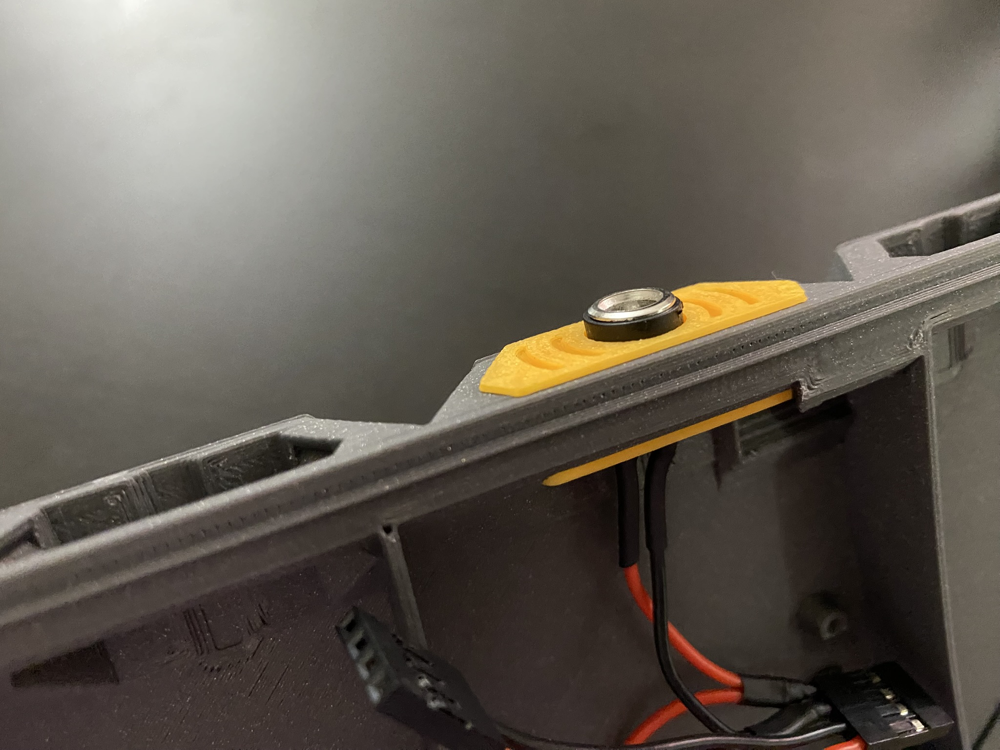

1. Route the sensor-in harness from [electronics preparation](/Docs/DOPM_Electronics_Preparation.md) step 7 through the [M_1b.0_FlowChamber_DOPM.stl](/STLs/1_FlowChamber/1b_DirectOnPanelMount/StealthMax/M_1b.0_FlowChamber_DOPM.stl) as follows.
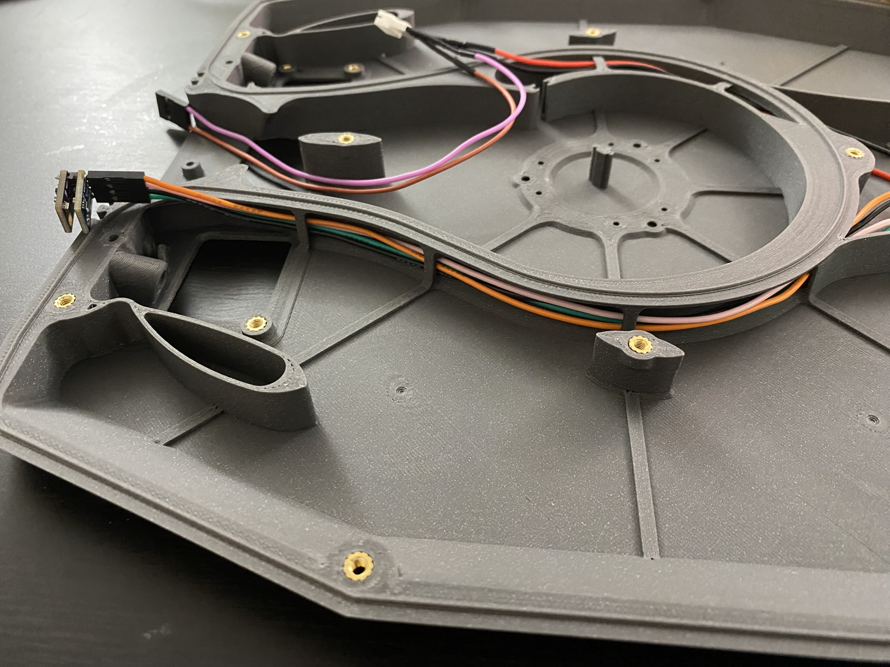

1. Route the sensor-out harness from [electronics preparation](/Docs/DOPM_Electronics_Preparation.md) step 8 through the [M_1b.0_FlowChamber_DOPM.stl](/STLs/1_FlowChamber/1b_DirectOnPanelMount/StealthMax/M_1b.0_FlowChamber_DOPM.stl) as follows.
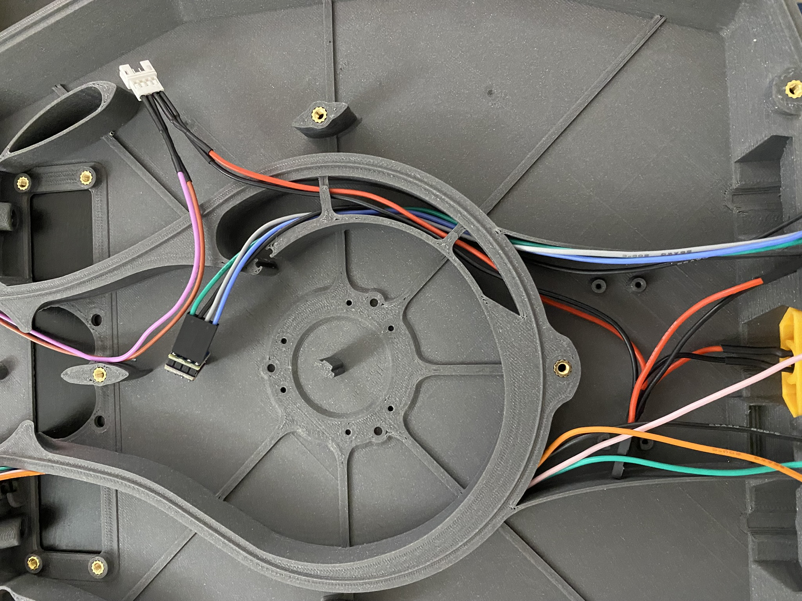

1. Crimp 2 DuPont female pins to the remaining uncrimped black and green wires from step 9. Two wires into one DuPont pin is a tight fit, but it can be done with some patience.
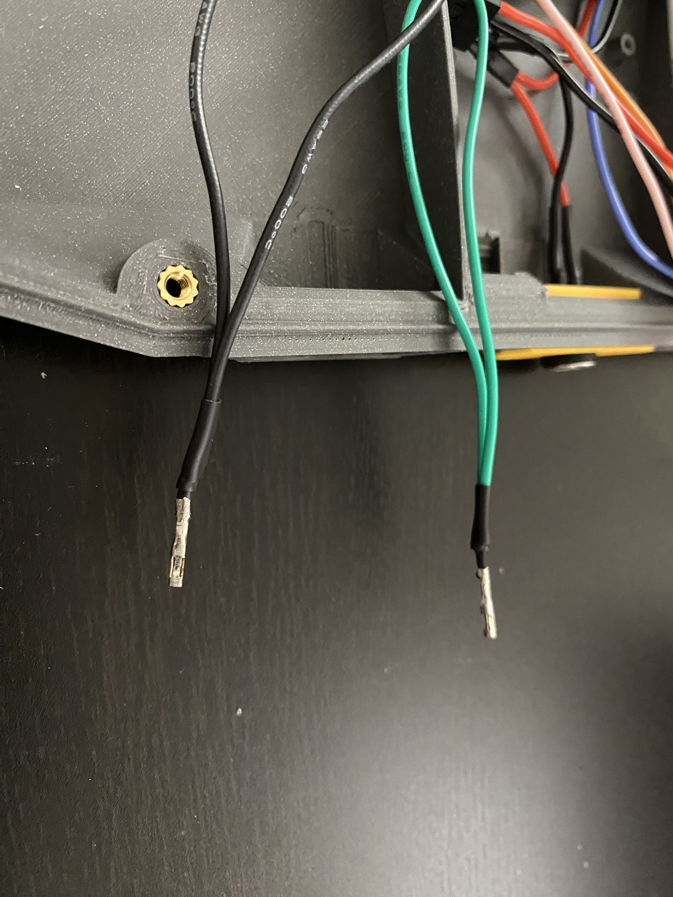

1. Insert the double-crimped green wires into the 4-pin DuPont connector from [electronics preparation](/Docs/DOPM_Electronics_Preparation.md) step 14, and the double-crimped black wires into a 5-pin DuPont connector, together with the pink, yellow, gray, and blue wires of the sensor-in and sensor-out harnesses.
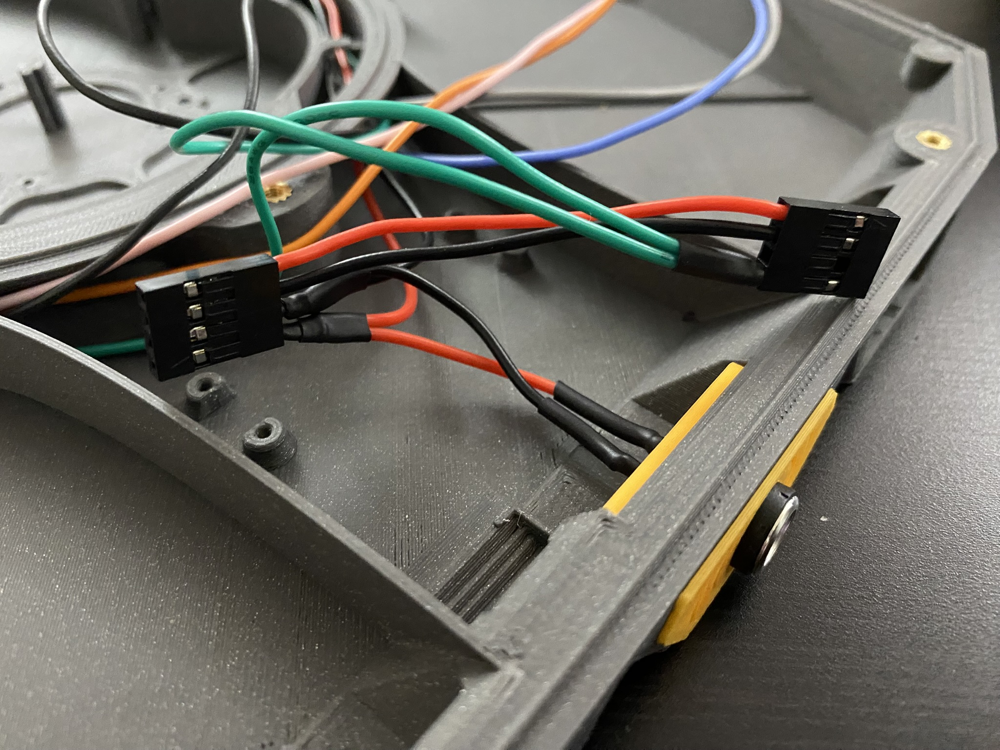
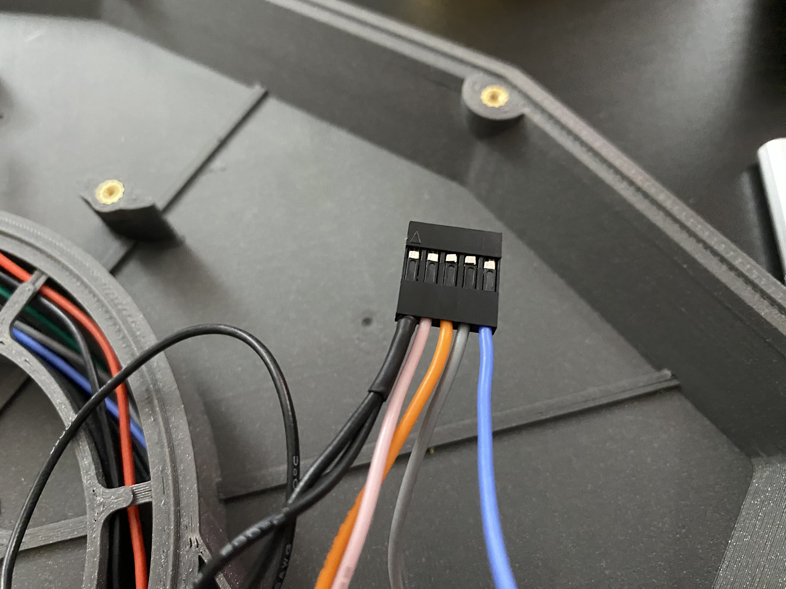

1. Connect the 2 4-pin and single 5-pin DuPont connector to the Raspberry Pi Pico W and route the cables underneath the Pico W while fastening the Pico W to the [M_1b.0_FlowChamber_DOPM.stl](/STLs/1_FlowChamber/1b_DirectOnPanelMount/StealthMax/M_1b.0_FlowChamber_DOPM.stl) using 4 [1.6_PCBSpacer.stl](/STLs/1_FlowChamber/1.6_PCBSpacer.stl) and 4 M2x6 self-tapping screws. Do not overtighten, as you are threading directly into plastic.
   - It helps to tape down the wires so they all sit flush underneath the Pico W. Fastening the Pico W can be a bit finicky, so be patient.
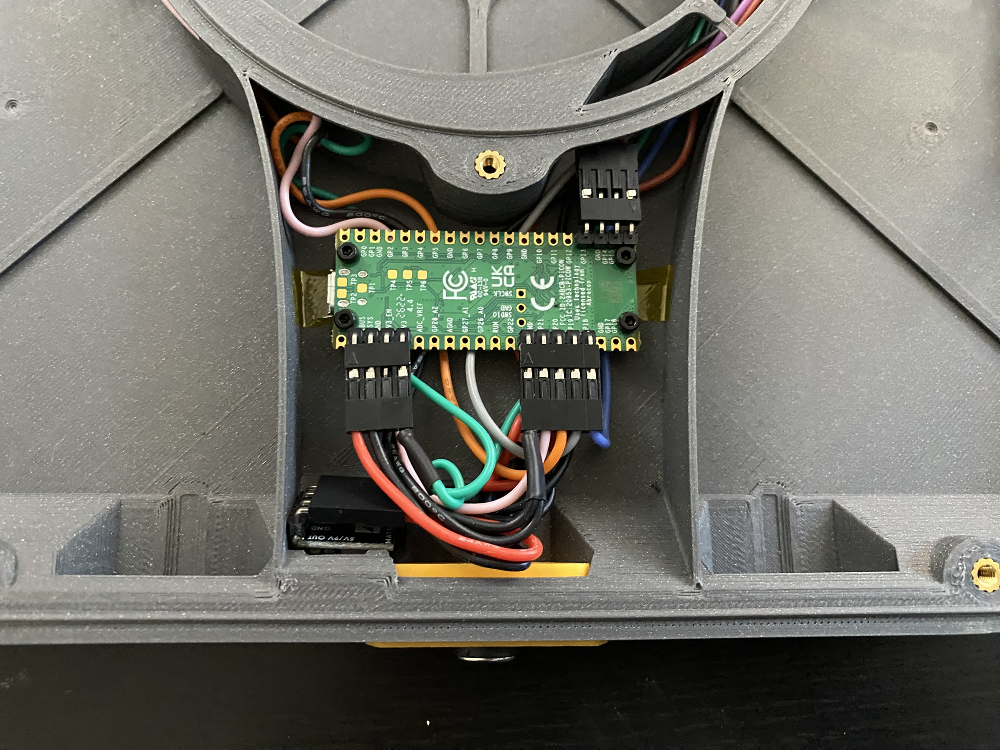

1. Fasten the sensor-in PCBs to the [M_1b.0_FlowChamber_DOPM.stl](/STLs/1_FlowChamber/1b_DirectOnPanelMount/StealthMax/M_1b.0_FlowChamber_DOPM.stl) using an M3x10 (or M3x8) BHCS. Do not overtighten, as you are threading directly into plastic.
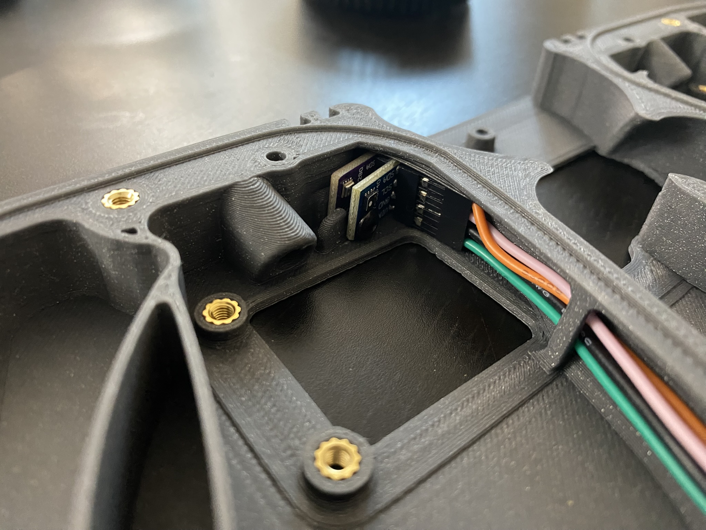

1. At this point break off the fan wire pin from the center of the [M_1b.0_FlowChamber_DOPM.stl](/STLs/1_FlowChamber/1b_DirectOnPanelMount/StealthMax/M_1b.0_FlowChamber_DOPM.stl). It should come off easily.
   -  If you misplaced the printed fan wire pin, you can reprint it: [1.5_FanWirePin_Spare.stl](/STLs/1_FlowChamber/1.5_FanWirePin_Spare.stl).
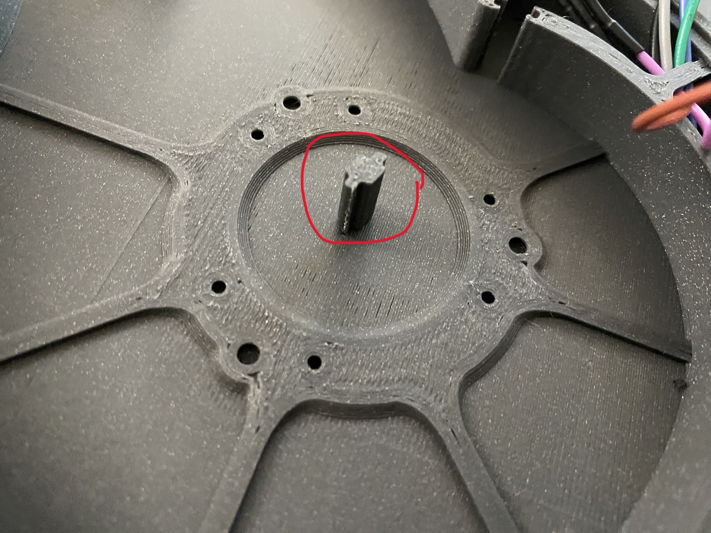

1. Place the Delta BFB0712HF fan in the center of the [M_1b.0_FlowChamber_DOPM.stl](/STLs/1_FlowChamber/1b_DirectOnPanelMount/StealthMax/M_1b.0_FlowChamber_DOPM.stl) and hold it down securely while flipping over the flow chamber to attach the Delta BFB0712HF fan using 3x M2x4 FHCS. Do not overtighten, as M2 screws are very fragile.
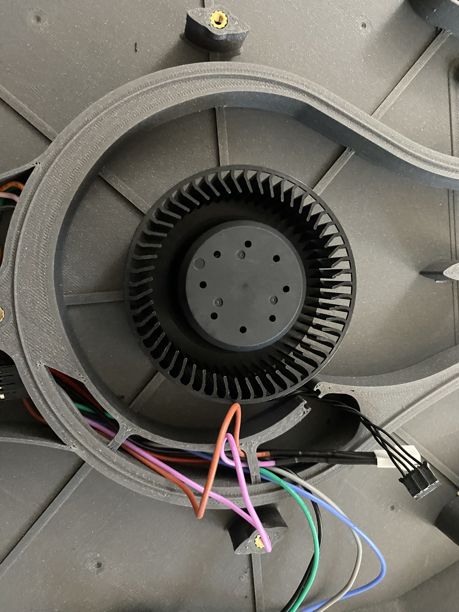
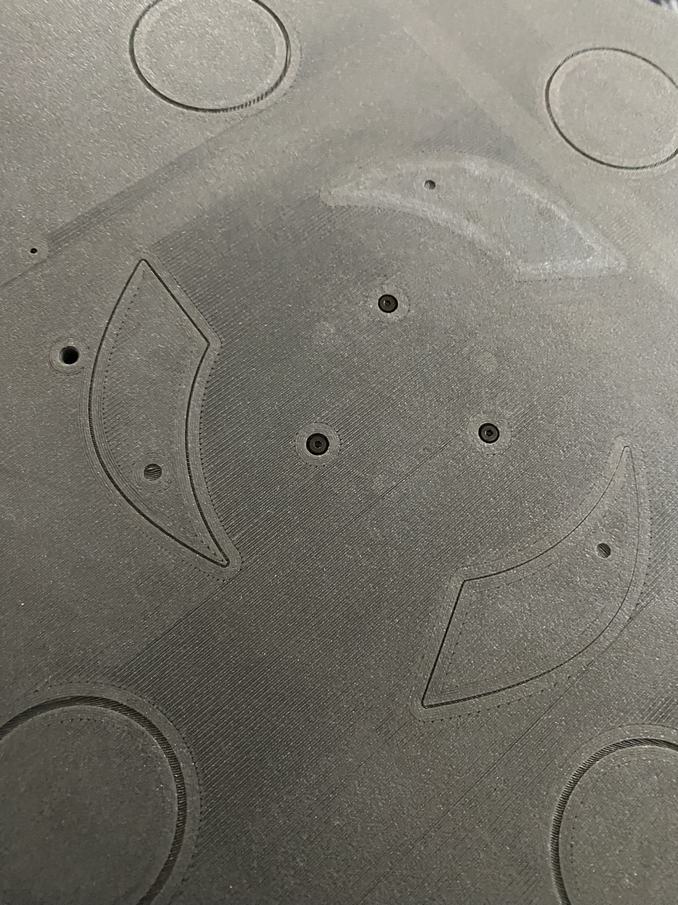

1.  Connect the Delta BFB0712HF fan connector to the 4-pin JST-PH 2.0 male pin/female connector.
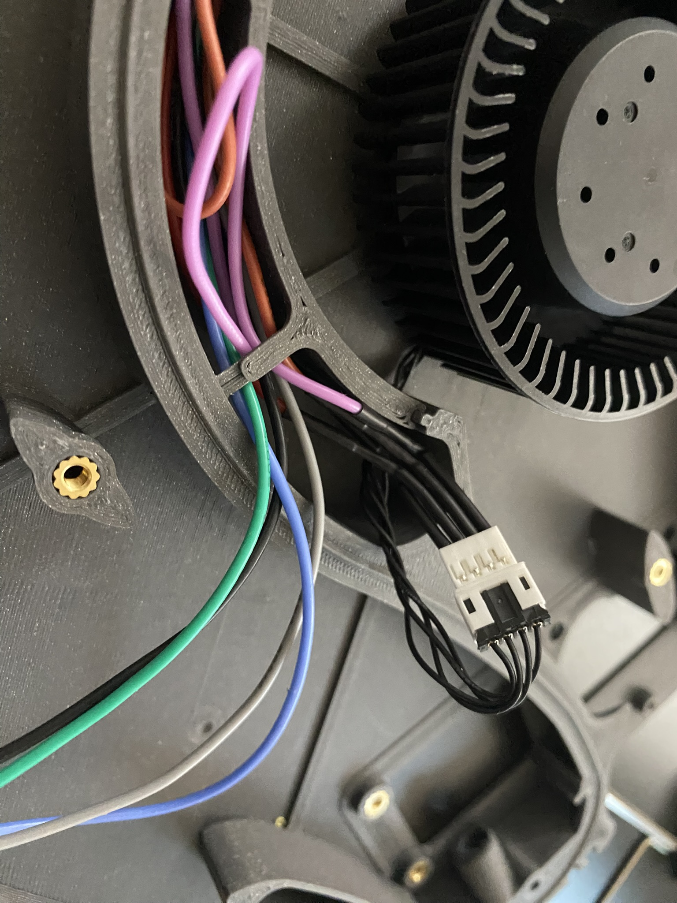

1.  Route the Delta BFB0712HF fan cable through the passage on the [M_1b.0_FlowChamber_DOPM.stl](/STLs/1_FlowChamber/1b_DirectOnPanelMount/StealthMax/M_1b.0_FlowChamber_DOPM.stl) and secure it down using the fan wire pin that was printed in the center of the flow chamber. Do not push down on the fan wire pin too hard, as you may damage the cable.
   - If you misplaced the printed fan wire pin, you can reprint it: [1.5_FanWirePin_Spare.stl](/STLs/1_FlowChamber/1.5_FanWirePin_Spare.stl).
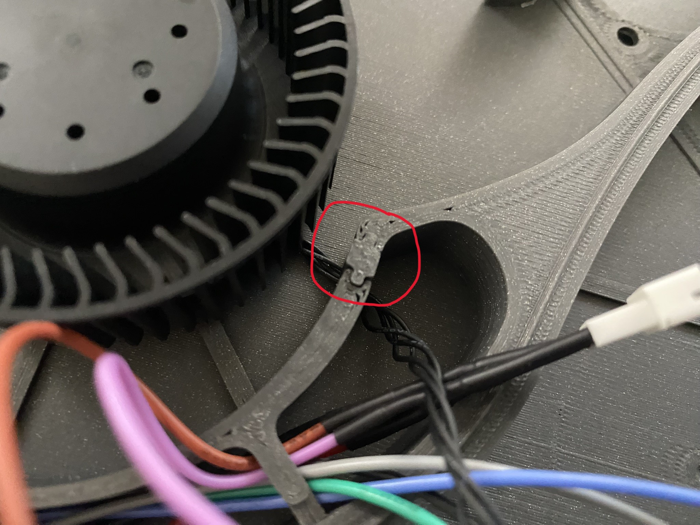

1.  Insert the [M_1b.1_RemovableAirDuct_DOPM.stl](/STLs/1_FlowChamber/1b_DirectOnPanelMount/StealthMax/M_1b.1_RemovableAirDuct_DOPM.stl) into the [M_1b.0_FlowChamber_DOPM.stl](/STLs/1_FlowChamber/1b_DirectOnPanelMount/StealthMax/M_1b.0_FlowChamber_DOPM.stl).
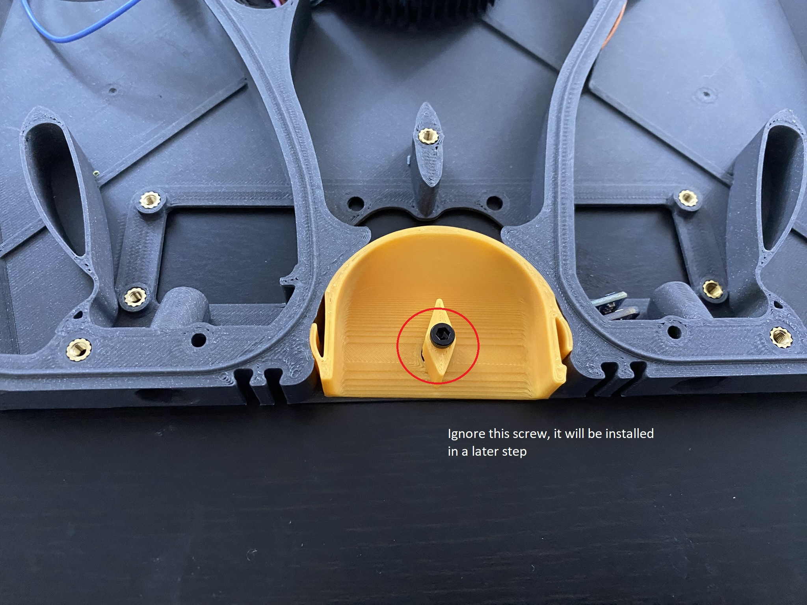

1.  Slide the [1.2_AirExhaustSlider.stl](/STLs/1_FlowChamber/1.2_AirExhaustSlider.stl) into the [M_1b.0_FlowChamber_DOPM.stl](/STLs/1_FlowChamber/1b_DirectOnPanelMount/StealthMax/M_1b.0_FlowChamber_DOPM.stl). IGNORE THE SCREW PLACED IN THIS PICTURE. It will be placed in a later step. The image is incorrect.
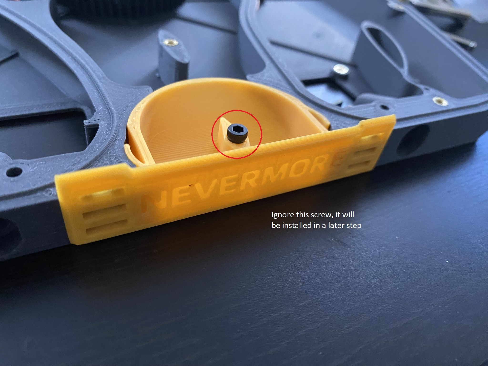

1.  Double-check that all the electronics and wiring before proceeding to the next step. See DOPM docs for a good picture.

[Next: Carbon Basket Assembly >](Carbon_Basket_Assembly.md)