# Back Panel Mount (BPM) Main Chamber Assembly Continued

These are instructions for the StealthMax (300) Smart Back Panel Mount (BPM). The majority of this part is borrowed from the DOPM documentation but with replaced images for continuity.

## Parts Required

Printed parts:
- 1x [M_2.0_MainChamber.stl](../../STLs/2_MainChamber/StealthMax/M_2.0_MainChamber.stl)
- 1x [M_3.0_LidFrame.stl](../../STLs/3_Lid/StealthMax/M_3.0_LidFrame.stl)
- 1x [M_2.7_IntakeSensorStackAccessLatch.stl](../../STLs/3_Lid/StealthMax/M_3.0_LidFrame.stl)
- 1x [M_2.8_BowdenTubeAccessLatch.stl](../../STLs/2_MainChamber/StealthMax/M_2.8_BowdenTubeAccessLatch.stl)
- 1x [M_2.6a_PicoAccessLatch.stl](../../STLs/2_MainChamber/StealthMax/M_2.6a_PicoAccessLatch.stl)
- 1x [M_2.5a_LogoCap.stl](../../STLs/2_MainChamber/StealthMax/M_2.5a_LogoCap.stl)
- 1x [M_2.3_HEPACover.stl](../../STLs/2_MainChamber/StealthMax/M_2.3_HEPACover.stl)
- 1x [1.3a_BowdenCap_Closed.stl](../../STLs/1_FlowChamber/1.3a_BowdenCap_Closed.stl)
- 1x [1.3b_BowdenCap_Open.stl](../../STLs/1_FlowChamber/1.3b_BowdenCap_Open.stl)

Hardware:
- 16x M3x6 BHCS
- 1x M3x10 (or M3x8) BHCS
- 1x M3x16 SHCS
- 1x PC4-M10 fitting
- 2x HEPA filters (for Xiaomi Mijia G1)

## Back Panel Mount (BPM) Main Chamber Assembly Continued

1. Route the sensor-out harness through the bottom of [M_2.0_MainChamber.stl](../../STLs/2_MainChamber/StealthMax/M_2.0_MainChamber.stl) and into the center area.
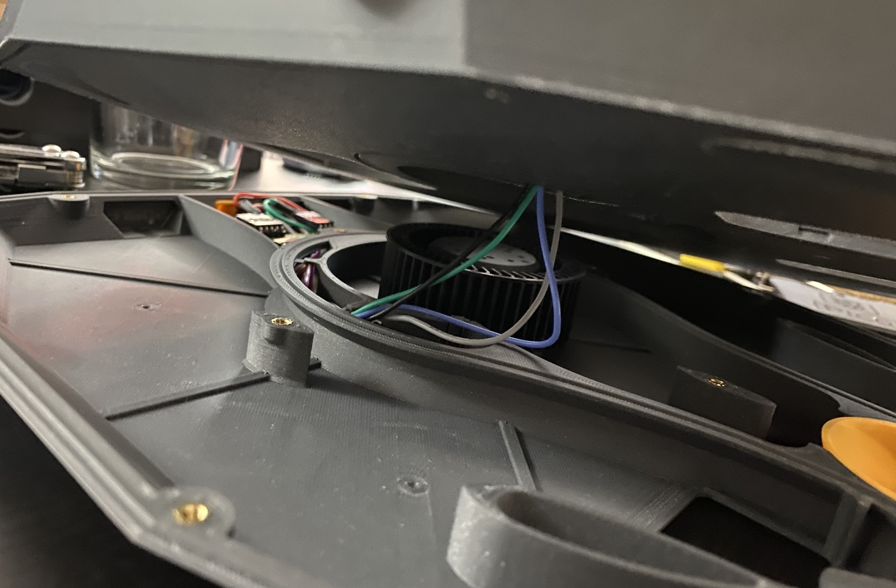
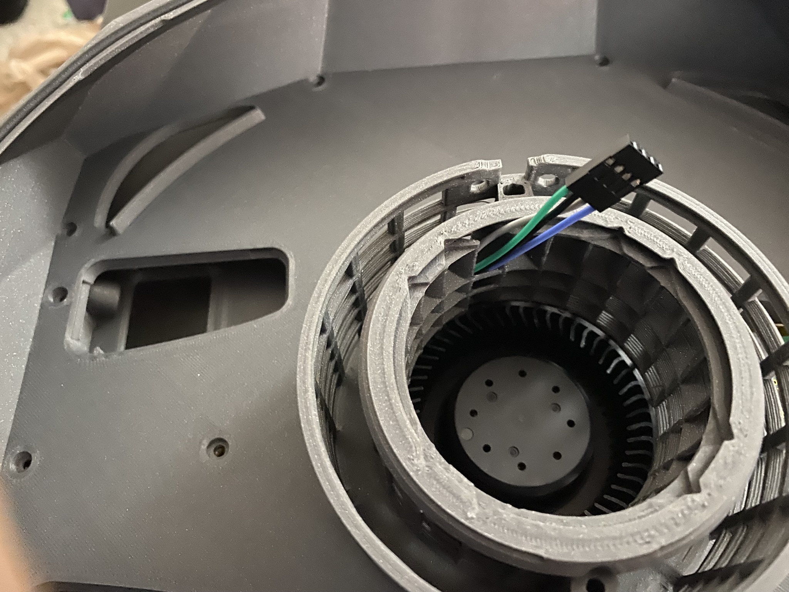

2. Insert the [M_2.7_IntakeSensorStackAccessLatch.stl](../../STLs/2_MainChamber/StealthMax/M_2.7_IntakeSensorStackAccessLatch.stl), [M_2.8_BowdenTubeAccessLatch.stl](../../STLs/2_MainChamber/StealthMax/M_2.8_BowdenTubeAccessLatch.stl), and [M_2.6a_PicoAccessLatch.stl](../../STLs/2_MainChamber/StealthMax/M_2.6a_PicoAccessLatch.stl), and fasten the [M_2.0_MainChamber.stl](../../STLs/2_MainChamber/StealthMax/M_2.0_MainChamber.stl) to the [M_1a.0_FlowChamber_BPM.stl](../../STLs/1_FlowChamber/1a_BackPanelMount/StealthMax/M_1a.0_FlowChamber_BPM.stl) using 12 M3x6 BHCS.
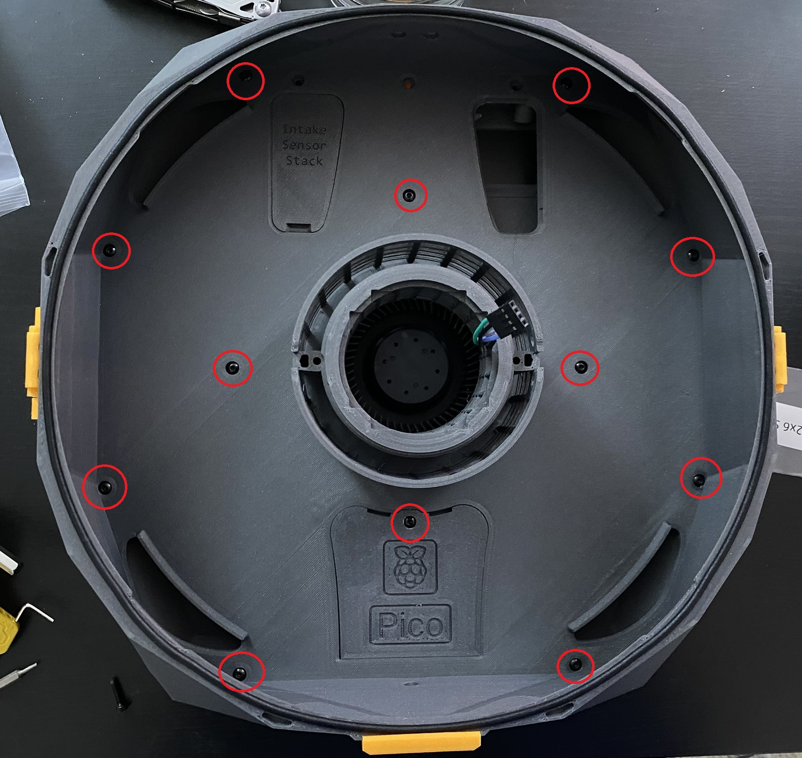

1. Fasten the [M_1a.1_AirExhaustWheel_BPM.stl](../../STLs/1_FlowChamber/1a_BackPanelMount/StealthMax/M_1a.1_AirExhaustWheel_BPM.stl) in place with M3x16
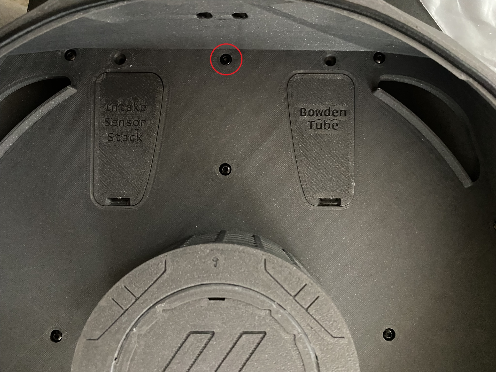

1. Gentle loosen the [3.2_LidFrontHinge.stl](../../STLs/3_Lid/3.2_LidFrontHinge.stl) attached to the [M_3.0_LidFrame.stl](../../STLs/3_Lid/StealthMax/M_3.0_LidFrame.stl) so it can freely move.
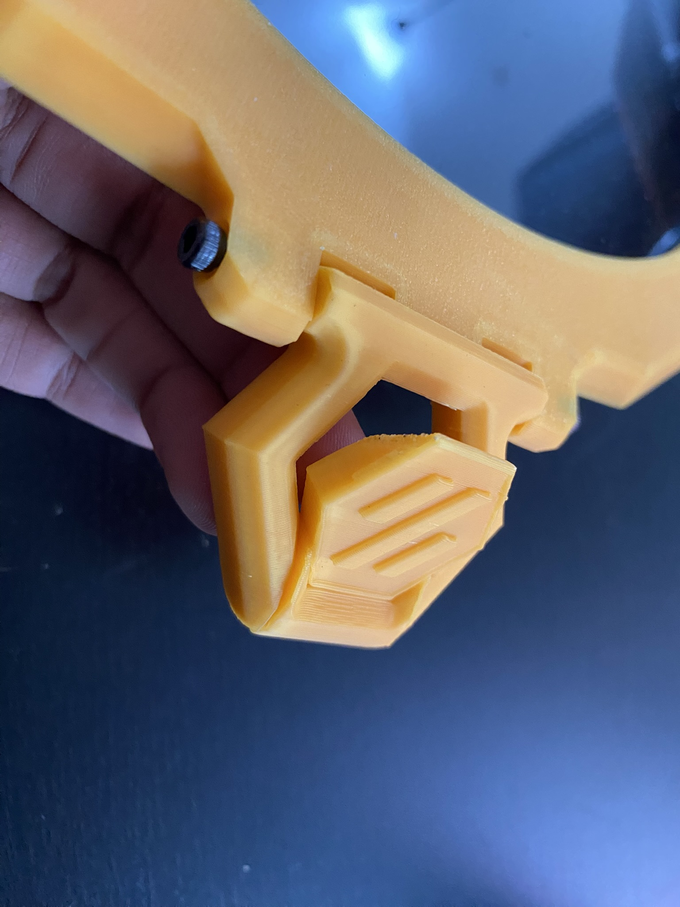

1. Fasten the [3.2_LidFrontHinge.stl](../../STLs/3_Lid/3.2_LidFrontHinge.stl) to the [M_2.0_MainChamber.stl](../../STLs/2_MainChamber/StealthMax/M_2.0_MainChamber.stl) using 2x M3x6 BHCS.
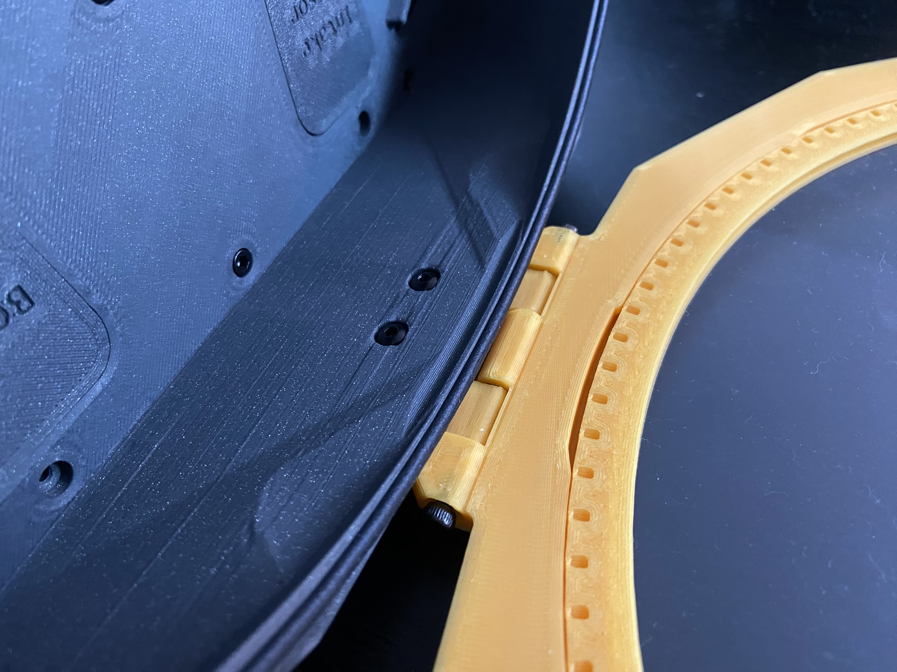

1. Insert the [M_2.1_CarbonBasket.stl](../../STLs/2_MainChamber/StealthMax/M_2.1_CarbonBasket.stl) into the [M_2.0_MainChamber.stl](../../STLs/2_MainChamber/StealthMax/M_2.0_MainChamber.stl) at an angle, aligning the protrusions of the carbon basket with the notches of the main chamber. Then rotate the carbon basket to lock it in place.
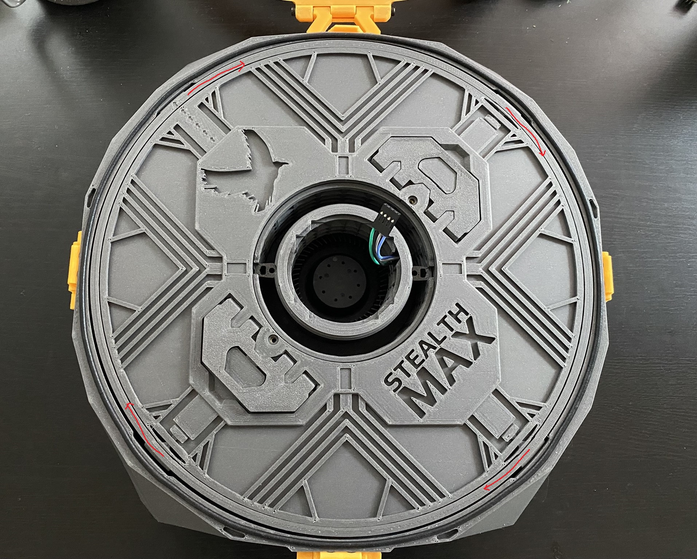
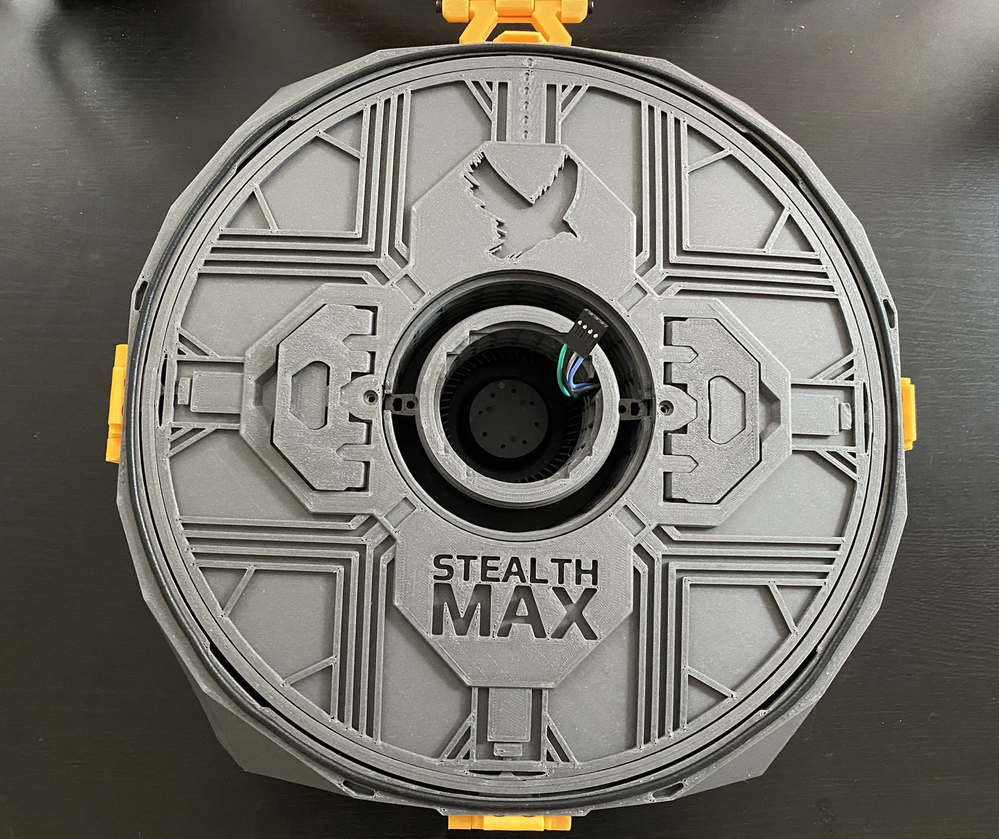

1. Fasten the sensor-out PCBs to the [M_2.5a_LogoCap.stl](../../STLs/2_MainChamber/StealthMax/M_2.5a_LogoCap.stl) using an M3x10 (or M3x8) BHCS. Do not overtighten, as you are threading directly into plastic.
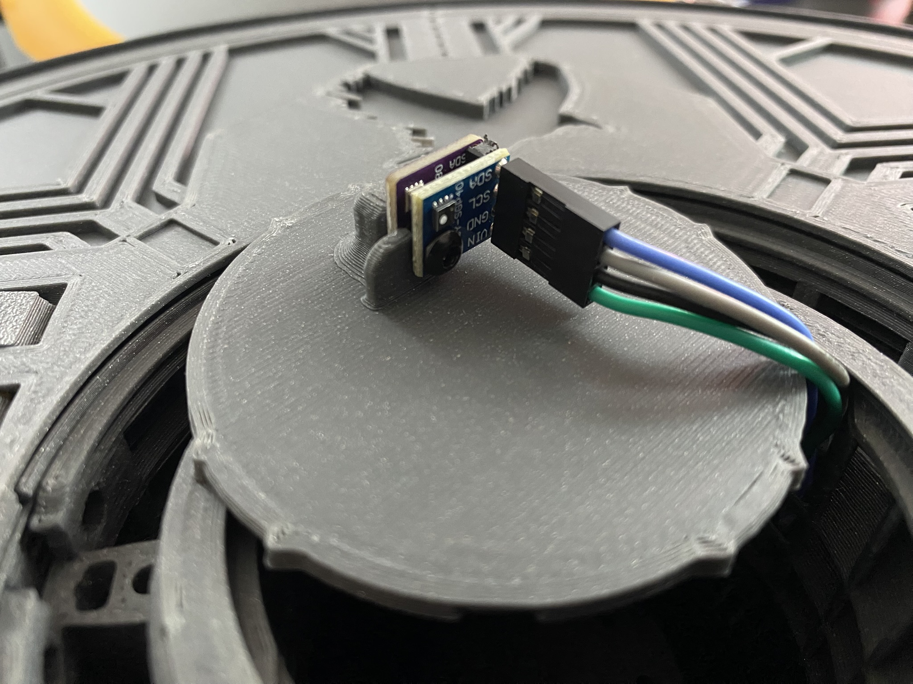

1. Flip the [M_2.5a_LogoCap.stl](../../STLs/2_MainChamber/StealthMax/M_2.5a_LogoCap.stl) and insert it into the center of the [M_2.0_MainChamber.stl](../../STLs/2_MainChamber/StealthMax/M_2.0_MainChamber.stl).
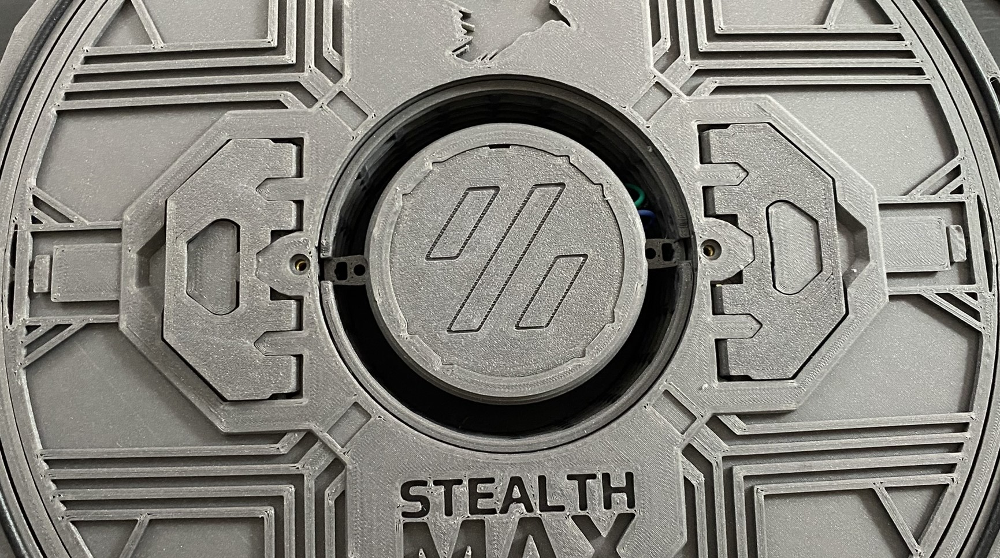

1. Insert the 2x HEPA filters (for Xiaomi Mijia G1) into the center area of the [M_2.0_MainChamber.stl](../../STLs/2_MainChamber/StealthMax/M_2.0_MainChamber.stl).
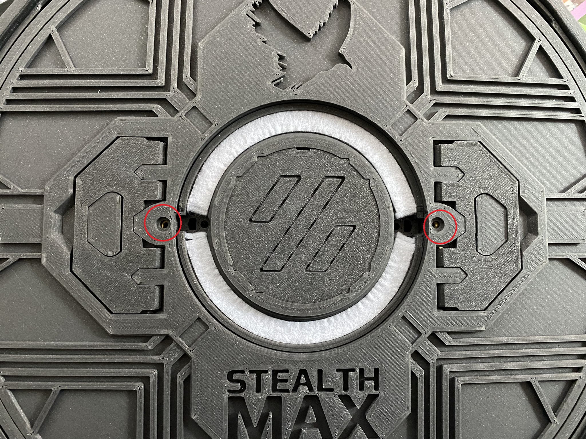

1. Snap in the [M_2.3_HEPACover.stl](../../STLs/2_MainChamber/StealthMax/M_2.3_HEPACover.stl) and fasten the [M_2.2b_CarbonBasketLid_noHandles.stl](../../STLs/2_MainChamber/StealthMax/M_2.2b_CarbonBasketLid_noHandles.stl) to the [M_2.1_CarbonBasket.stl](../../STLs/2_MainChamber/StealthMax/M_2.1_CarbonBasket.stl) with 2x M3x6 BHCS.
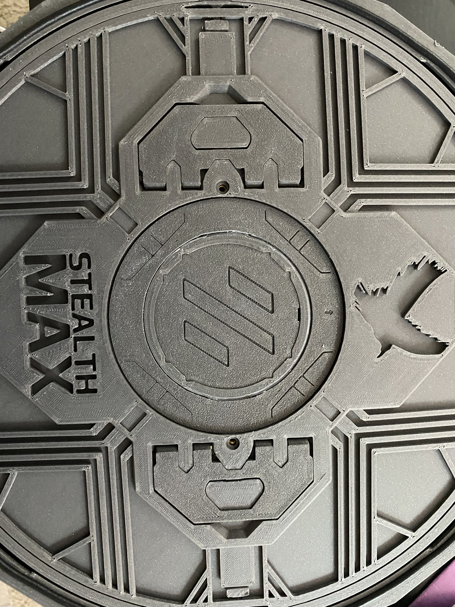

1. Screw in the PC4-M10 fitting to [1.3b_BowdenCap_Open.stl](../../STLs/1_FlowChamber/1.3b_BowdenCap_Open.stl). Snap in the [1.3a_BowdenCap_Closed.stl](../../STLs/1_FlowChamber/1.3a_BowdenCap_Closed.stl) and [1.3b_BowdenCap_Open.stl](../../STLs/1_FlowChamber/1.3b_BowdenCap_Open.stl) to the front of the [M_1a.0_FlowChamber_BPM.stl](../../STLs/1_FlowChamber/1a_BackPanelMount/StealthMax/M_1a.0_FlowChamber_BPM.stl). The positioning will depend on which way you route the bowden for the filament path.
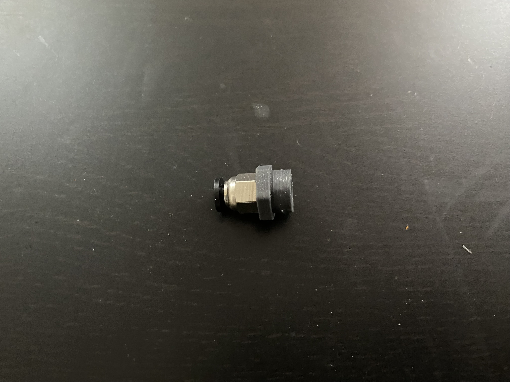
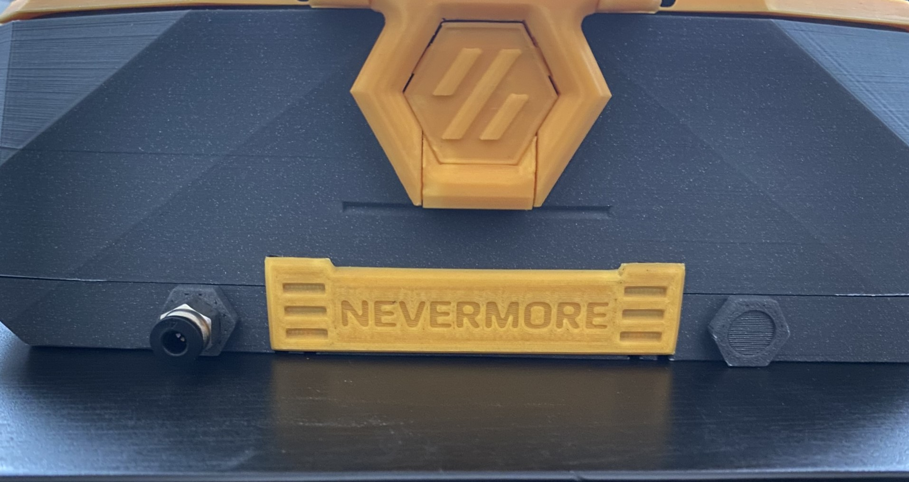

1.  STOP: Connect the StealthMax to power and continue software configuration according to the [Nevermore Controller Setup Guide](https://github.com/SanaaHamel/nevermore-controller#guide-setup). 
    1.  If one of your sensors is unplugged, better to know now than once it's mounted.

1. Once all software is configured, continue to the next step for back panel mounting.

[Next: Back Panel Mount (BPM) Mounting >](BPM_Mounting.md)