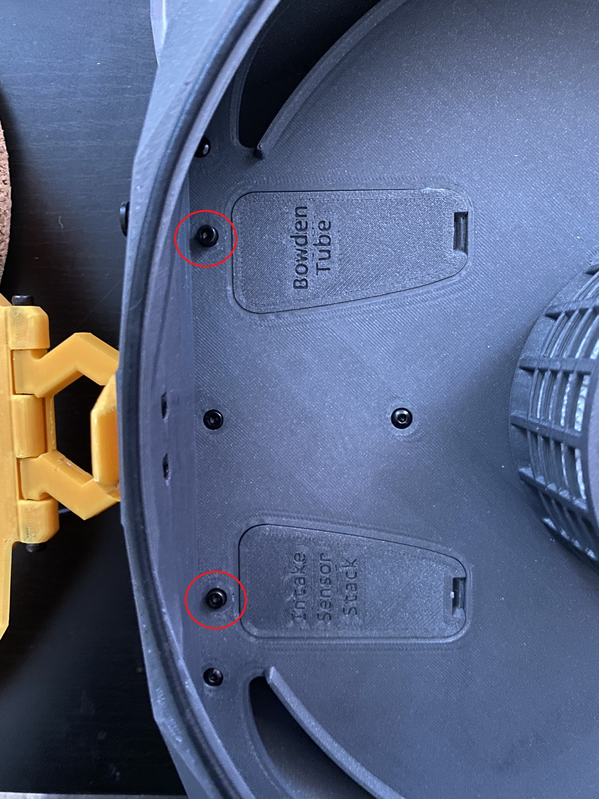
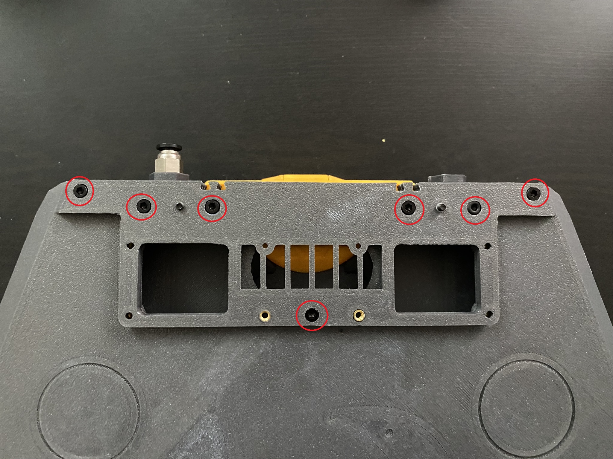
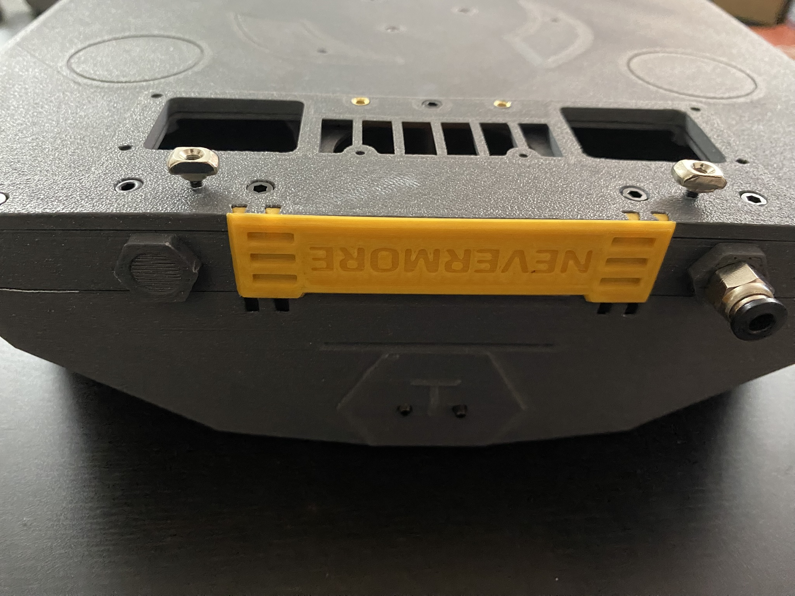
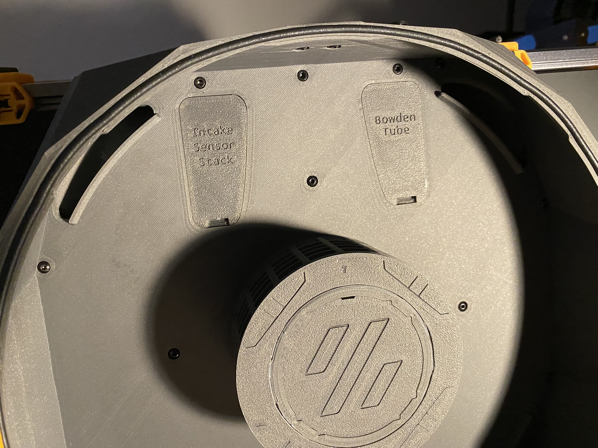
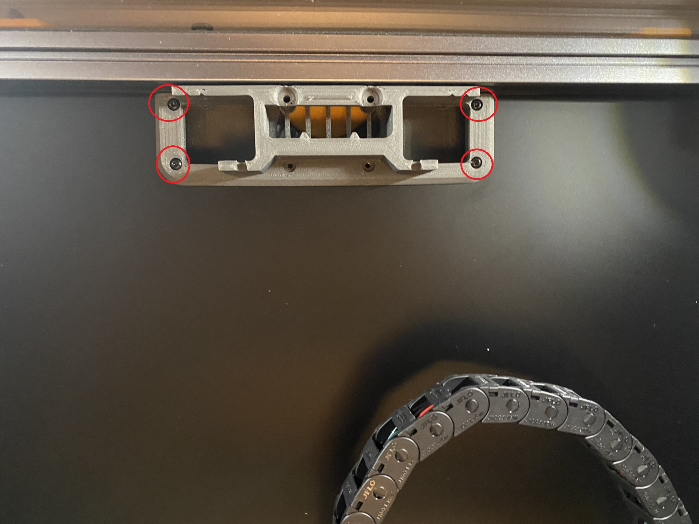
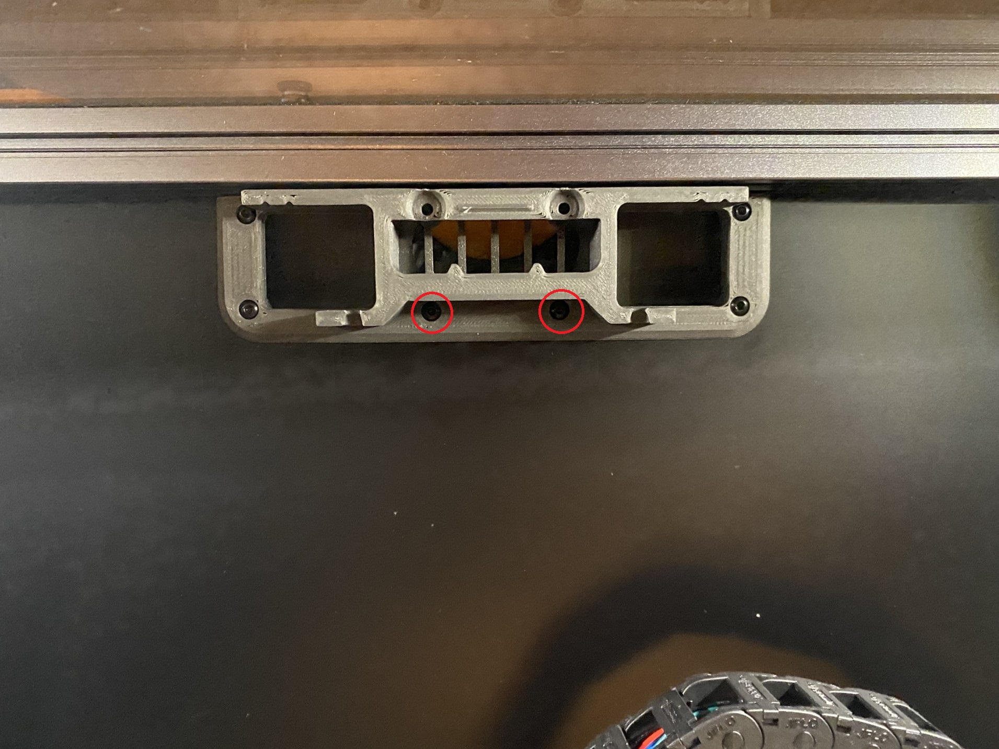
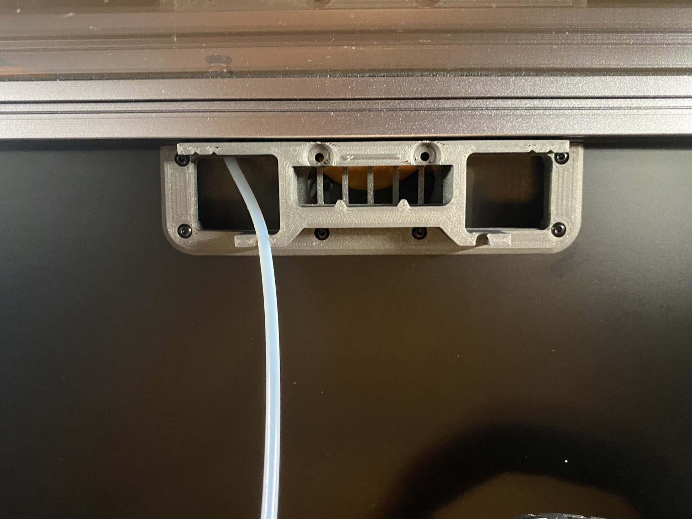

# Back Panel Mount (BPM) Main Chamber Assembly Continued

These are instructions for the StealthMax (300) Smart Back Panel Mount (BPM).

## Parts Required

Printed parts:
- 1x [Main Chamber Assembly](../../Docs/BPM/BPM_Main_Chamber_Assembly_Continued.md)
- 1x [M_0a.0_VoronExhaustFitting_BPM.stl](../../STLs/0_Mount/0a_BackPanelMount/StealthMax/M_0a.0_VoronExhaustFitting_BPM.stl)
- 1x [0a.1_BackPanelMount_BPM.stl](../../STLs/0_Mount/0a_BackPanelMount/0a.1_BackPanelMount_BPM.stl)
- 1x [0a.2_BackPanelMountCover_BPM.stl](../../STLs/0_Mount/0a_BackPanelMount/0a.2_BackPanelMountCover_BPM.stl)

Hardware:
- 2x M3x25 SHCS
- 7x M3x12 SHCS
- 2x M3 Hammerhead Nut (could sub M3 roll in)
- 4x M3x10 BHCS
- 2x M3x6 BHCS
- 2x M3x20 SHCS

## Back Panel Mount (BPM) Main Chamber Assembly Continued

1. Remove the carbon basket assembly from the the main chamber. You may also find it easier to remove the lid assembly as well.

1. Insert two M3x25 SHCS into the holes marked in the [main chamber assembly](../../Docs/BPM/BPM_Main_Chamber_Assembly_Continued.md). Thread them in so the tiniest bit is poking through the other side.

1. Align the [M_0a.0_VoronExhaustFitting_BPM.stl](../../STLs/0_Mount/0a_BackPanelMount/StealthMax/M_0a.0_VoronExhaustFitting_BPM.stl)'s grooves on the [main chamber assembly](../../Docs/BPM/BPM_Main_Chamber_Assembly_Continued.md) and screw into place with 7x M3x12 SHCS. Screw the M3x25 BHCS from the previous step all the way through.

1. Loosely screw on the M3 hammerhead nuts to the exposed end of the M3x25 SHCS.

1. Place the [main chamber assembly](../../Docs/BPM/BPM_Main_Chamber_Assembly_Continued.md) on the back rear extrusion of the Voron 2.4. The [M_0a.0_VoronExhaustFitting_BPM.stl](../../STLs/0_Mount/0a_BackPanelMount/StealthMax/M_0a.0_VoronExhaustFitting_BPM.stl) should fit cleanly in the hole in rear panel. Make sure the the hammerhead nuts are inside the extrusion and screw the M3x25 SHCS into place. The [main chamber assembly](../../Docs/BPM/BPM_Main_Chamber_Assembly_Continued.md) should now be attached to the back extrusion.

1. Attach the [0a.1_BackPanelMount_BPM.stl](../../STLs/0_Mount/0a_BackPanelMount/0a.1_BackPanelMount_BPM.stl) to the [M_0a.0_VoronExhaustFitting_BPM.stl](../../STLs/0_Mount/0a_BackPanelMount/StealthMax/M_0a.0_VoronExhaustFitting_BPM.stl) with 4 M3x10 BHCS as shown in the picture.

1. Add two M3x6 BHCS to hold the [0a.1_BackPanelMount_BPM.stl](../../STLs/0_Mount/0a_BackPanelMount/0a.1_BackPanelMount_BPM.stl) to the [M_0a.0_VoronExhaustFitting_BPM.stl](../../STLs/0_Mount/0a_BackPanelMount/StealthMax/M_0a.0_VoronExhaustFitting_BPM.stl).

1. Route your PTFE tubing for the filament path through the PC4-M10 fitting in the [main chamber assembly](../../Docs/BPM/BPM_Main_Chamber_Assembly_Continued.md) to your desired length to reach the toolhead. This should be one piece since the fitting only acts as a stopper preventing the tube from coming loose. Make sure this goes through the little slot in the [0a.1_BackPanelMount_BPM.stl](../../STLs/0_Mount/0a_BackPanelMount/0a.1_BackPanelMount_BPM.stl).

1. Secure the [0a.2_BackPanelMountCover_BPM.stl](../../STLs/0_Mount/0a_BackPanelMount/0a.2_BackPanelMountCover_BPM.stl) with 2 M3x20 SHCS.

1. You're done! Now is a good time to fill up your carbon basket and [calibrate your sensors](https://github.com/SanaaHamel/nevermore-controller/blob/main/doc/voc.adoc#baseline-calibration).

