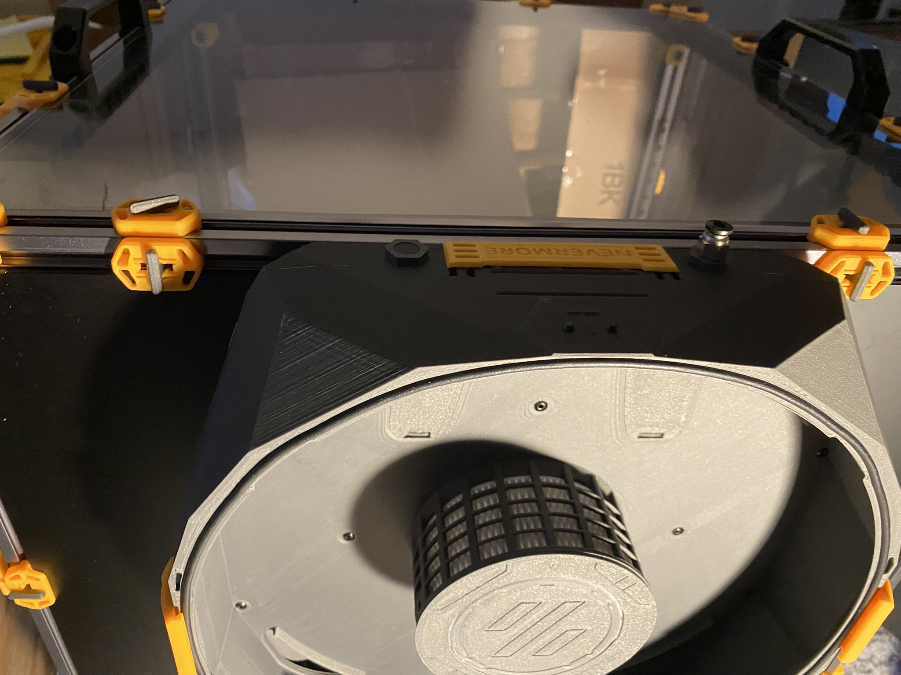
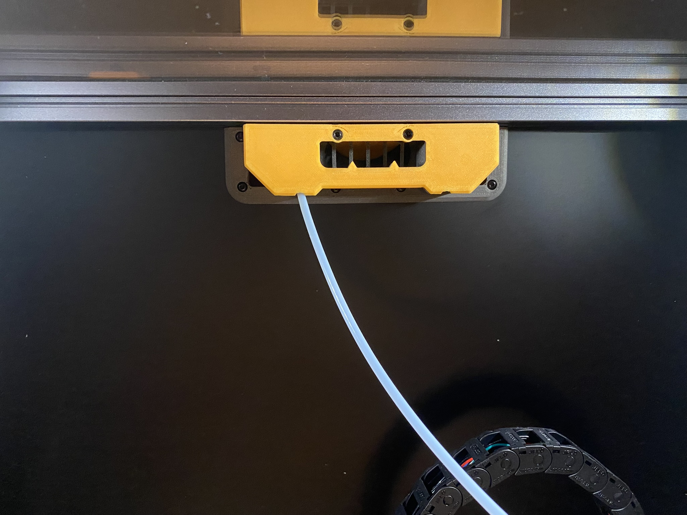

# Back Panel Mount (BPM) Main Chamber Assembly Continued

These are instructions for the StealthMax (300) Smart Back Panel Mount (BPM).

## Parts Required

Printed parts:
- 1x [M_2.0_MainChamber.stl](/STLs/2_MainChamber/StealthMax/M_2.0_MainChamber.stl)
- 1x [M_3.0_LidFrame.stl](/STLs/3_Lid/StealthMax/M_3.0_LidFrame.stl)
- 1x [M_2.7_IntakeSensorStackAccessLatch.stl](/STLs/2_MainChamber/StealthMax/M_2.7_IntakeSensorStackAccessLatch.stl)
- 1x [M_2.8_BowdenTubeAccessLatch.stl](/STLs/2_MainChamber/StealthMax/M_2.8_BowdenTubeAccessLatch.stl)
- 1x [M_2.6a_PicoAccessLatch.stl](/STLs/2_MainChamber/StealthMax/M_2.6a_PicoAccessLatch.stl)
- 1x [M_2.5a_LogoCap.stl](/STLs/2_MainChamber/StealthMax/M_2.5a_LogoCap.stl)
- 1x [M_2.3_HEPACover.stl](/STLs/2_MainChamber/StealthMax/M_2.3_HEPACover.stl)
- 2x [1.3a_BowdenCap_Closed.stl](/STLs/1_FlowChamber/1.3a_BowdenCap_Closed.stl)

Hardware:
- ??x M3x6 BHCS
- 1x M3x10 (or M3x8) BHCS
- 2x HEPA filters (for Xiaomi Mijia G1)

## Direct On Panel Mount (DOPM) Main Chamber Assembly Continued

1. Insert two M3x25 SH into the holes marked

