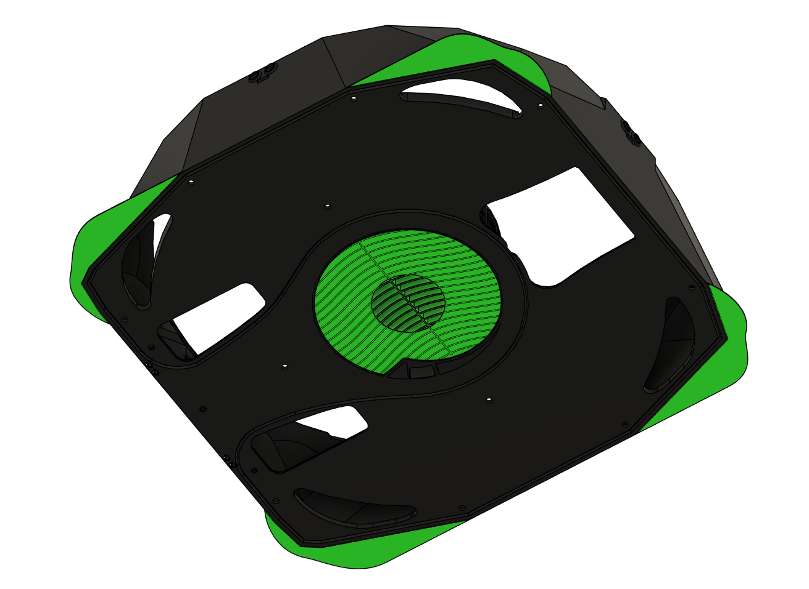
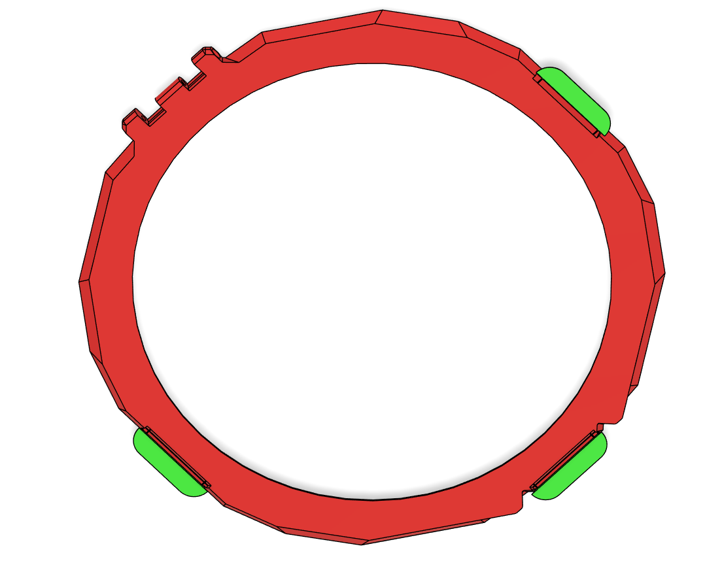
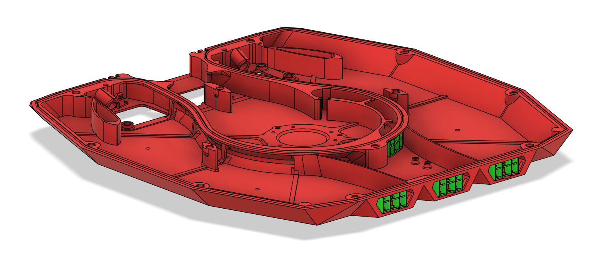
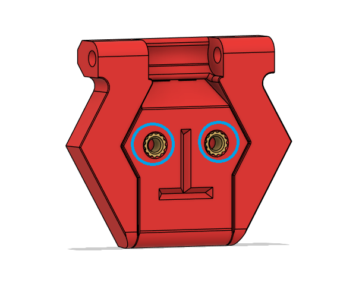
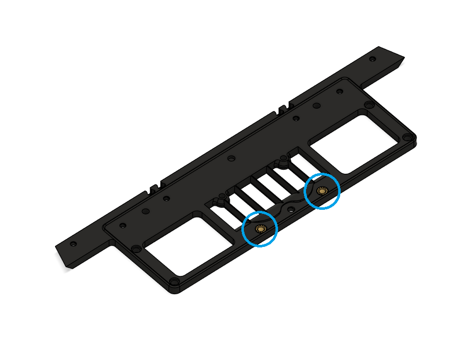
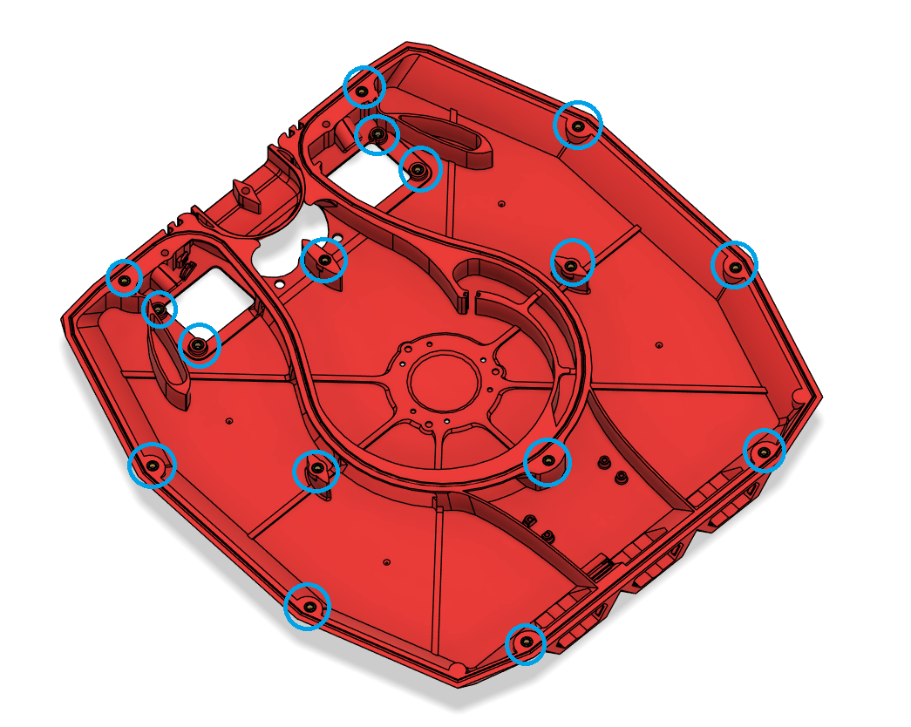
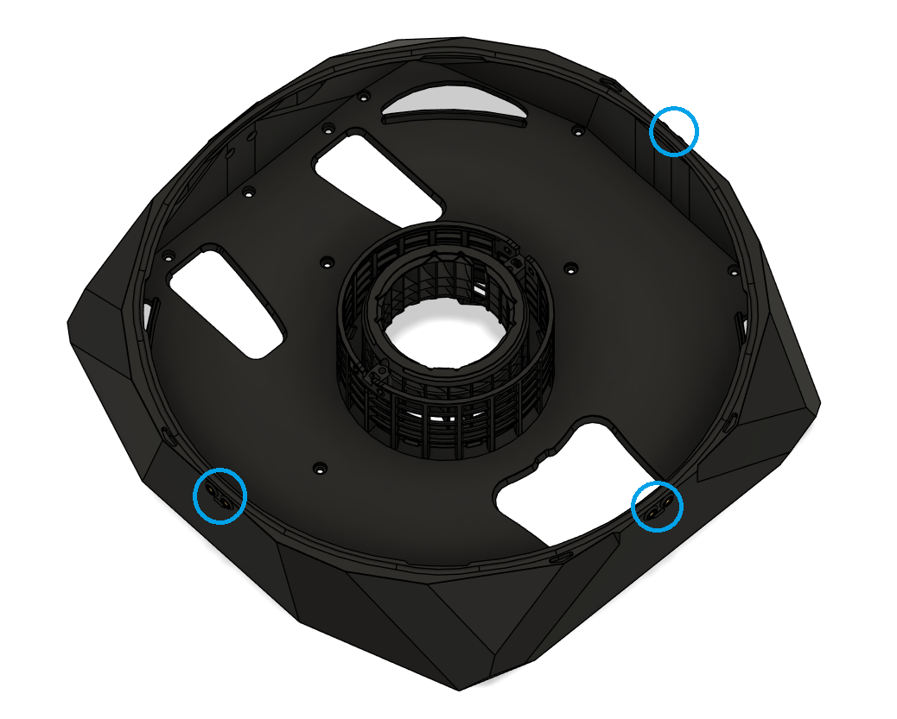
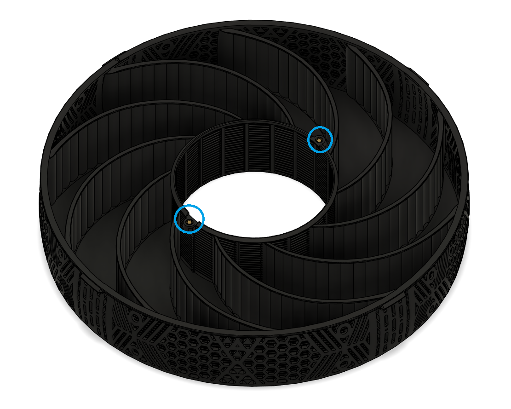

# Back Panel Mount (BPM) Preparation

These are instructions for the StealthMax (300) Back Panel Mount (BPM). I would highly reccomend reading through the DOPM documentation for more pictures as a majority of the assembly will be similar between the two.

## Support removal

Start by removing the built-in support material on these parts (indicated by green color). 

### Main Chamber ([M_2.0_MainChamber.stl](../../STLs/2_MainChamber/StealthMax/M_2.0_MainChamber.stl))

### Lid Frame ([M_3.0_LidFrame.stl](../../STLs/3_Lid/StealthMax/M_3.0_LidFrame.stl))

### Flow Chamber ([M_1b.0_FlowChamber_DOPM.stl](../../STLs/1_FlowChamber/1a_BackPanelMount/StealthMax/M_1a.0_FlowChamber_BPM.stl))

## Heat-Set Inserts

There are 28 heat-set inserts in total to be inserted on these parts (indicated by the blue circles).

### Lid Front Hinge x2 ([3.2_LidFrontHinge.stl](../../STLs/3_Lid/3.2_LidFrontHinge.stl))

### Voron Exhaust Fitting x2 ([M_0a.0_VoronExhaustFitting_BPM.stl](../../STLs/0_Mount/0a_BackPanelMount/StealthMax/M_0a.0_VoronExhaustFitting_BPM.stl))

### Flow Chamber x16 ([M_1b.0_FlowChamber_DOPM.stl](../../STLs/1_FlowChamber/1a_BackPanelMount/StealthMax/M_1a.0_FlowChamber_BPM.stl))

### Main Chamber x6 ([M_2.0_MainChamber.stl](../../STLs/2_MainChamber/StealthMax/M_2.0_MainChamber.stl))

### Carbon Basket x2 ([M_2.1_CarbonBasket.stl](../../STLs/2_MainChamber/StealthMax/M_2.1_CarbonBasket.stl))

[Next: Lid Assembly >](Lid_Assembly.md)