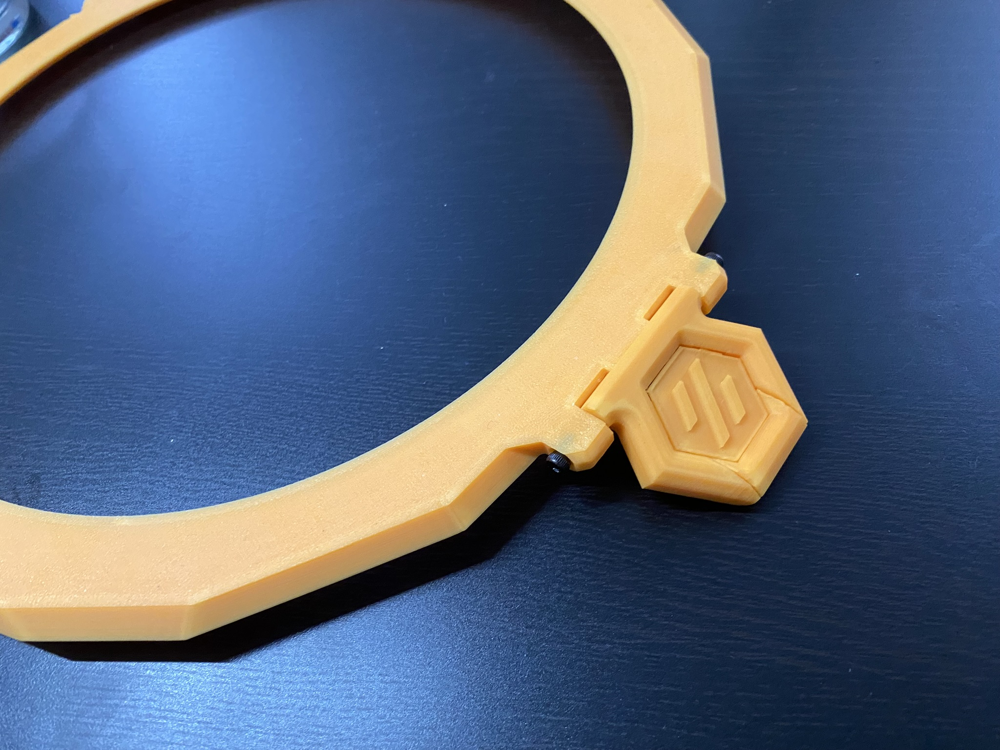
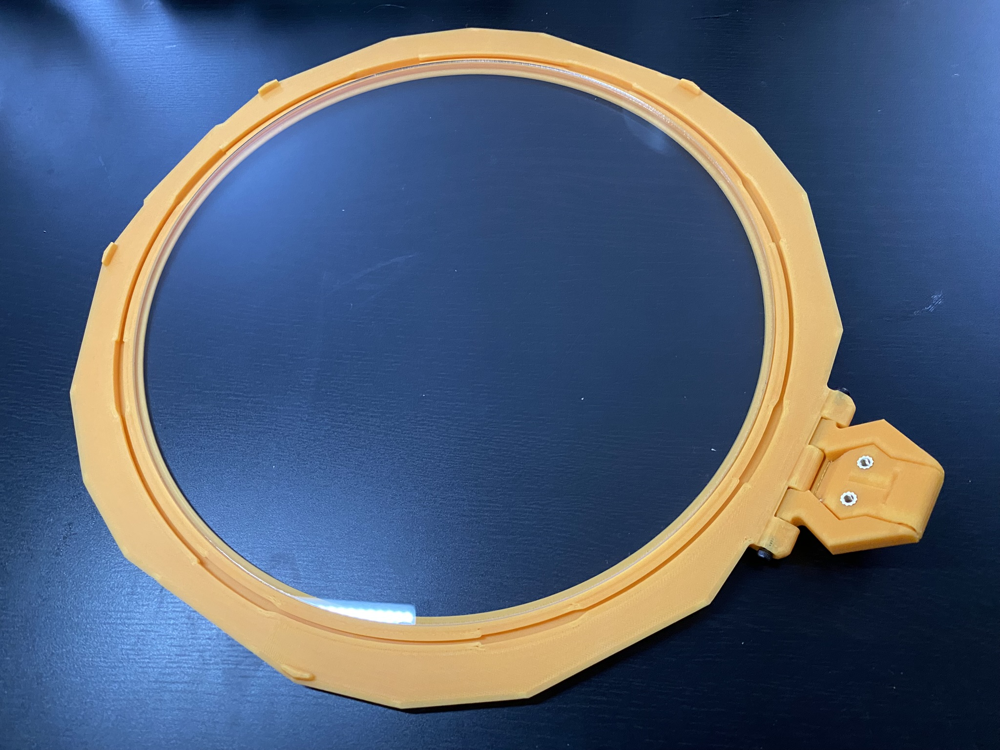
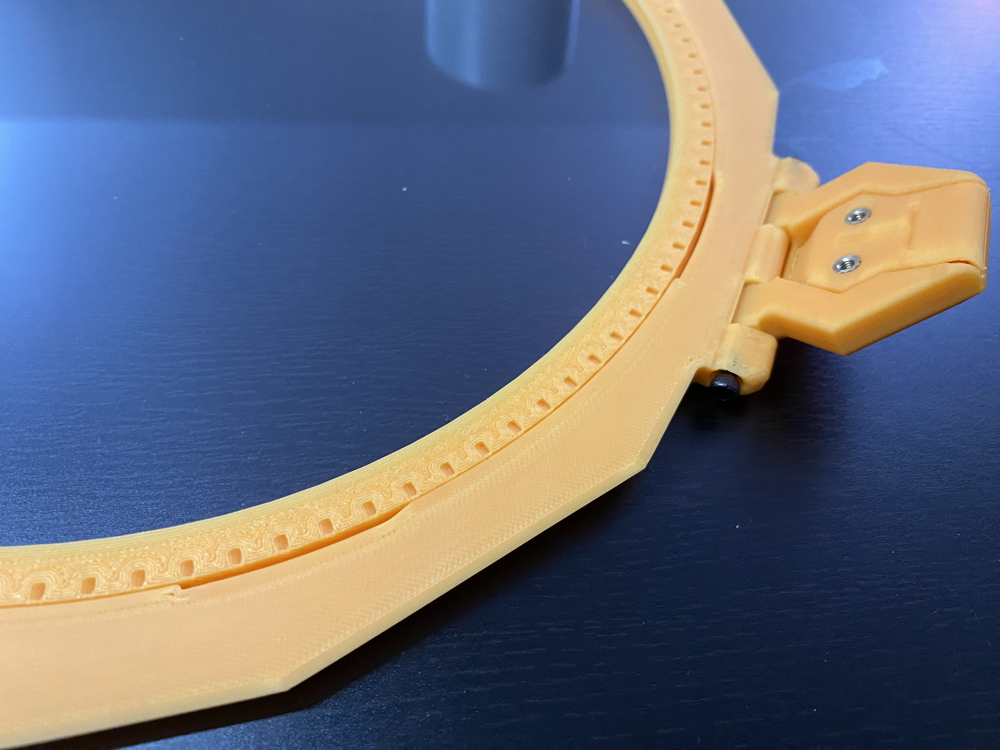
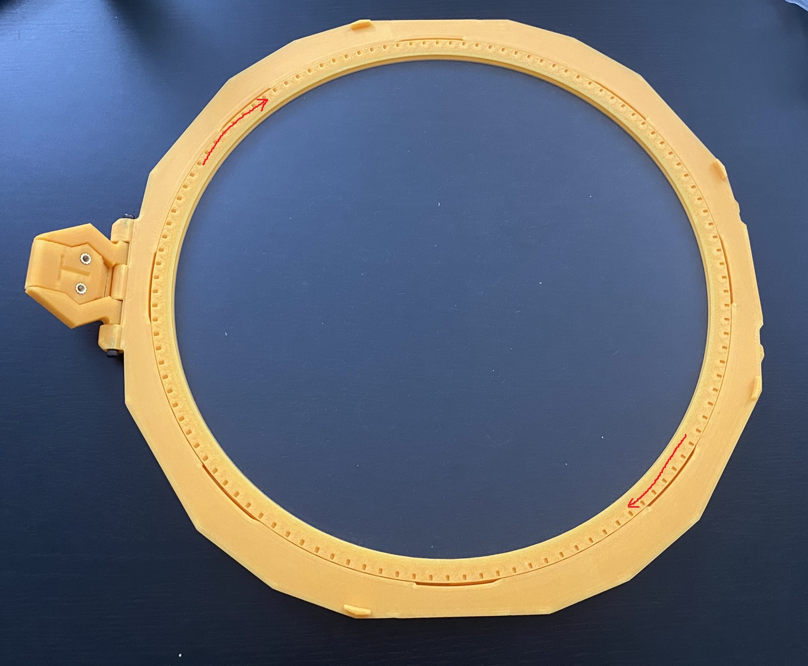

# Lid Assembly

These are instructions for the StealthMax (300) Back Panel Mount (BPM) or Direct On Panel Mount (DOPM). The majority of this part is borrowed from the DOPM documentation but with replaced images for continuity.

## Parts Required

Printed parts:
- 1x [M_3.0_LidFrame.stl](../../STLs/3_Lid/StealthMax/M_3.0_LidFrame.stl)
- 1x [M_3.1_LidPanelHolder.stl](../../STLs/3_Lid/StealthMax/M_3.1_LidPanelHolder.stl)
- 1x [3.2_LidFrontHinge.stl](../../STLs/3_Lid/3.2_LidFrontHinge.stl)

Hardware:
- 1x 250x3mm round acrylic panel (or Ghetto Panel mod)
- 2x M3x25 SHCS

## Lid Assembly

1. Attach [3.2_LidFrontHinge.stl](../../STLs/3_Lid/3.2_LidFrontHinge.stl) to the hinge location on [M_3.1_LidPanelHolder.stl](../../STLs/3_Lid/StealthMax/M_3.1_LidPanelHolder.stl) using 2x M3x25 SHCS. Do not overtighten, as you are threading directly into plastic.

2. Flip [M_3.1_LidPanelHolder.stl](../../STLs/3_Lid/StealthMax/M_3.1_LidPanelHolder.stl) over and fully insert the 250x3mm round acrylic panel (or Ghetto Panel mod) in the center.

3. Insert [M_3.0_LidFrame.stl](../../STLs/3_Lid/StealthMax/M_3.0_LidFrame.stl) into [M_3.1_LidPanelHolder.stl](../../STLs/3_Lid/StealthMax/M_3.1_LidPanelHolder.stl), aligning the notches so it sits flush.

4. Rotate [M_3.0_LidFrame.stl](../../STLs/3_Lid/StealthMax/M_3.0_LidFrame.stl) so it becomes locked into [M_3.1_LidPanelHolder.stl](../../STLs/3_Lid/StealthMax/M_3.1_LidPanelHolder.stl).

[Next: Main Chamber Assembly >](Main_Chamber_Assembly.md)