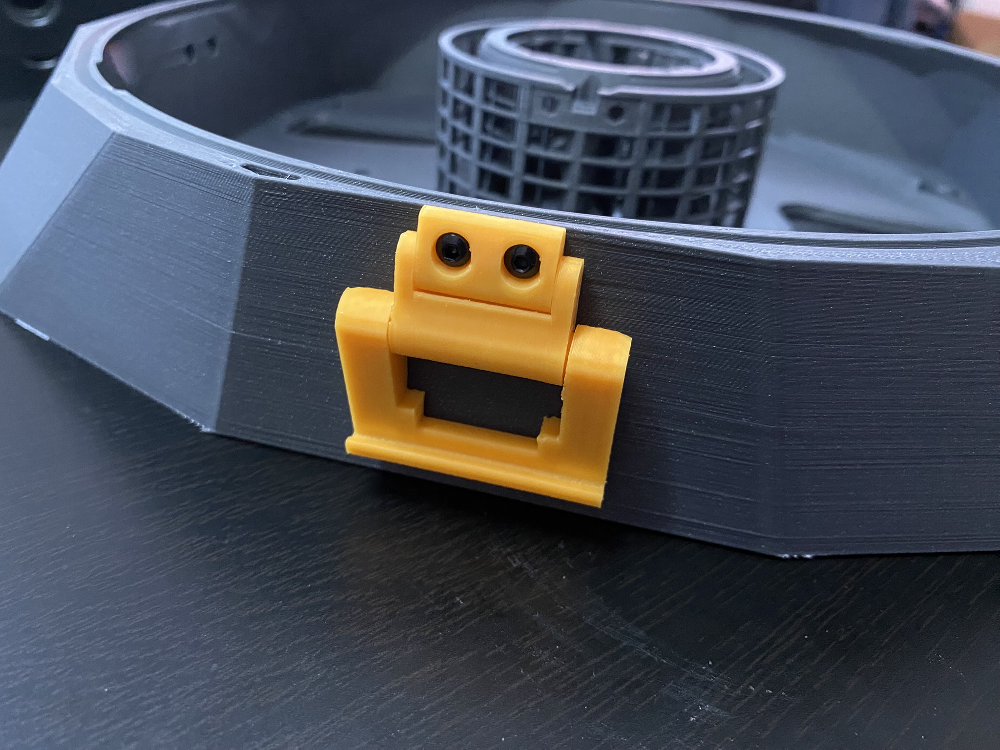
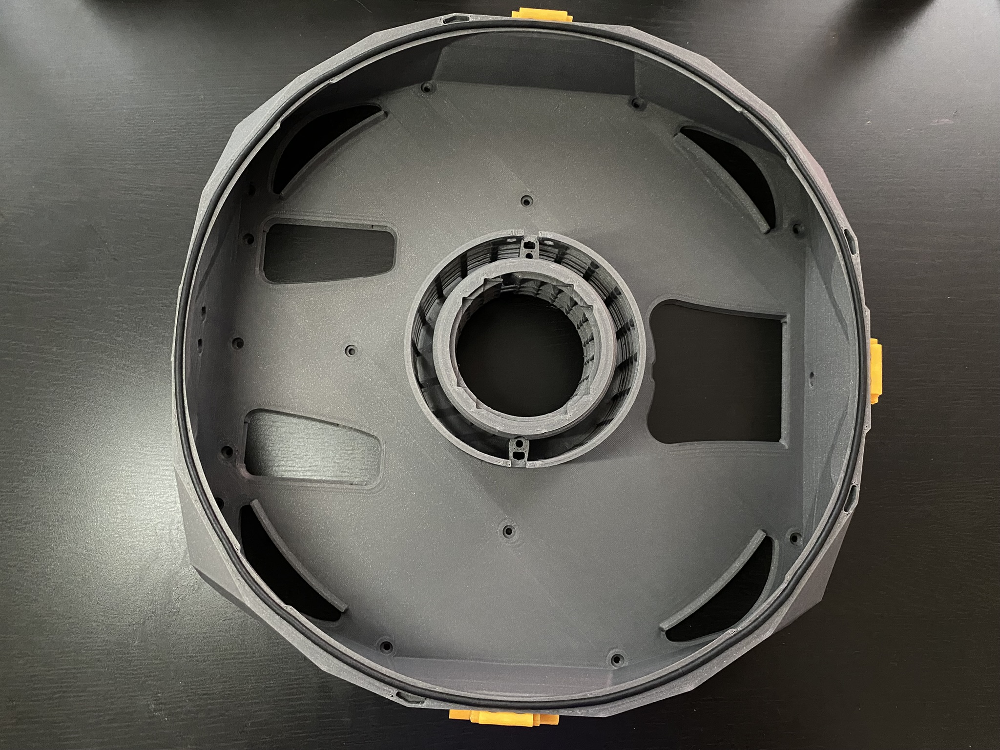
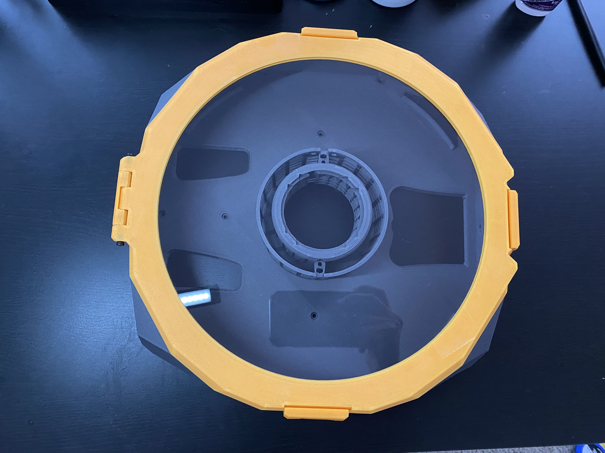

# Main Chamber Assembly

These are instructions for the StealthMax (300) Back Panel Mount (BPM) or Direct On Panel Mount (DOPM). The majority of this part is borrowed from the DOPM documentation but with replaced images for continuity.

## Parts Required

Printed parts:
- 1x [M_2.0_MainChamber.stl](../../STLs/2_MainChamber/StealthMax/M_2.0_MainChamber.stl)
- 3x [3.3_LidLatch.stl](../../STLs/3_Lid/3.3_LidLatch.stl)

Hardware:
- 6x M3x6 BHCS
- 3mm sponge cord
- Super glue

## Main Chamber Assembly

1. Ensure your 3x [3.3_LidLatch.stl](../../STLs/3_Lid/3.3_LidLatch.stl) are able to freely rotate after gently snapping them loose according to the [instructions on the Wiki](https://github.com/nevermore3d/StealthMax/wiki/Assembly#compression-latches).

2. Attach [3.3_LidLatch.stl](../../STLs/3_Lid/3.3_LidLatch.stl) to the three sides of [M_2.0_MainChamber.stl](../../STLs/2_MainChamber/StealthMax/M_2.0_MainChamber.stl) with the double M3 heat-set inserts near the top, using 2x M3x6 BHCS for each latch. Do not overtighten.

3. Attach the 3mm sponge cord all around [M_2.0_MainChamber.stl](/STLs/2_MainChamber/StealthMax/M_2.0_MainChamber.stl) using a thin layer of super glue, according to the [instructions on the Wiki](https://github.com/nevermore3d/StealthMax/wiki/Assembly#lid).

4. Optional: Dry-fit the [lid assembly](Lid_Assembly.md) on top of [M_2.0_MainChamber.stl](/STLs/2_MainChamber/StealthMax/M_2.0_MainChamber.stl) to ensure all latches properly close. Note that [3.2_LidFrontHinge.stl](/STLs/3_Lid/3.2_LidFrontHinge.stl) will be attached to [M_2.0_MainChamber.stl](/STLs/2_MainChamber/StealthMax/M_2.0_MainChamber.stl) in a later step.

[Next: Back Panel Mount (BPM) Electronics Preparation >](BPM_Electronics_Preparation.md)