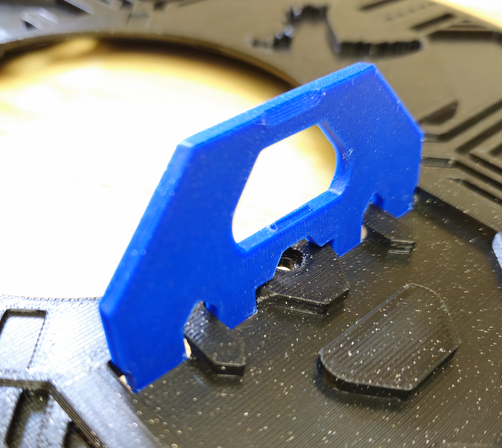
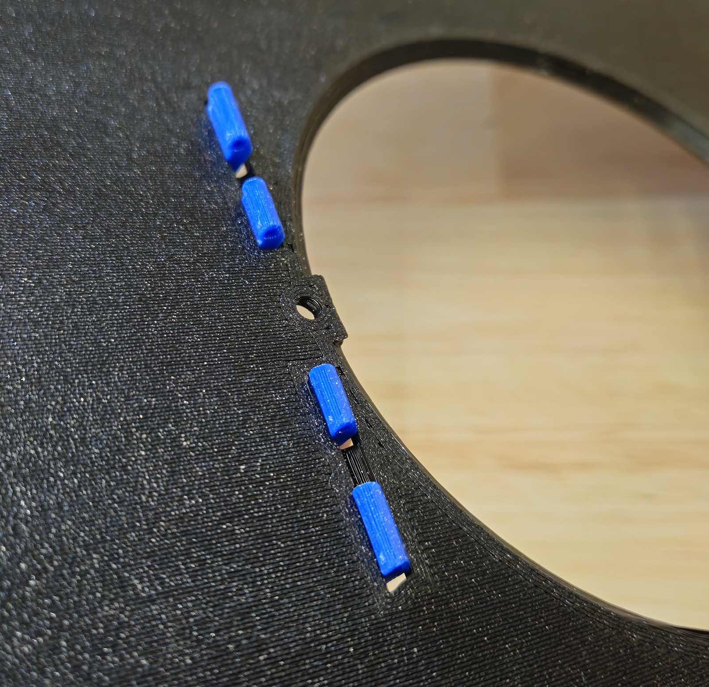
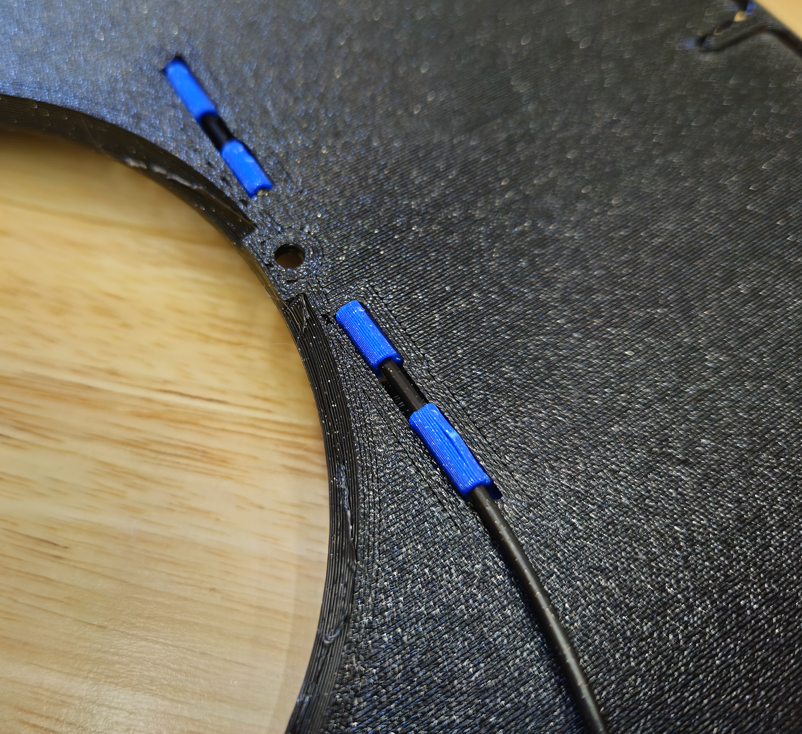
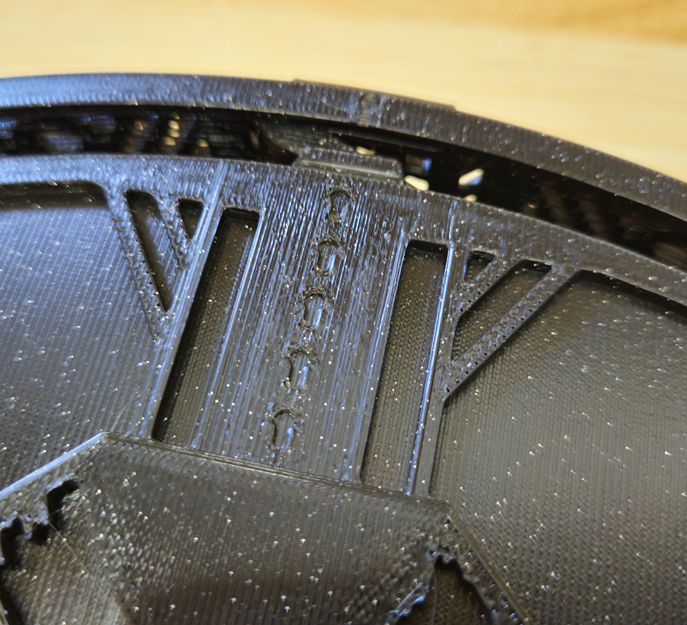

# Carbon Basket Assembly

These are instructions for the StealthMax (300) Back Panel Mount (BPM) or Direct On Panel Mount (DOPM).

## Parts Required

Printed parts:
- 1x [M_2.1_CarbonBasket.stl](/STLs/2_MainChamber/StealthMax/M_2.1_CarbonBasket.stl)
- 1x [M_2.2b_CarbonBasketLid_noHandles.stl](/STLs/2_MainChamber/StealthMax/M_2.2b_CarbonBasketLid_noHandles.stl)
- 2x [2.9_CarbonBasketLidHandle_Spare.stl](/STLs/2_MainChamber/2.9_CarbonBasketLidHandle_Spare.stl)

Hardware:
- 1.75mm 3D printing filament

## Carbon Basket Assembly

1. Insert a [2.9_CarbonBasketLidHandle_Spare.stl](/STLs/2_MainChamber/2.9_CarbonBasketLidHandle_Spare.stl) into a corresponding slot on [M_2.2b_CarbonBasketLid_noHandles.stl](/STLs/2_MainChamber/StealthMax/M_2.2b_CarbonBasketLid_noHandles.stl) and flip it over.

2. Use some 1.75mm 3D printing filament to lock the handle in place from the back, cutting off the excess.

3. Insert the [M_2.2b_CarbonBasketLid_noHandles.stl](/STLs/2_MainChamber/StealthMax/M_2.2b_CarbonBasketLid_noHandles.stl) on top of the [M_2.1_CarbonBasket.stl](/STLs/2_MainChamber/StealthMax/M_2.1_CarbonBasket.stl) using the orientation indicators for alignment.

[Next: Direct On Panel Mount (DOPM) Main Chamber Assembly Continued >](DOPM_Main_Chamber_Assembly_Continued.md)