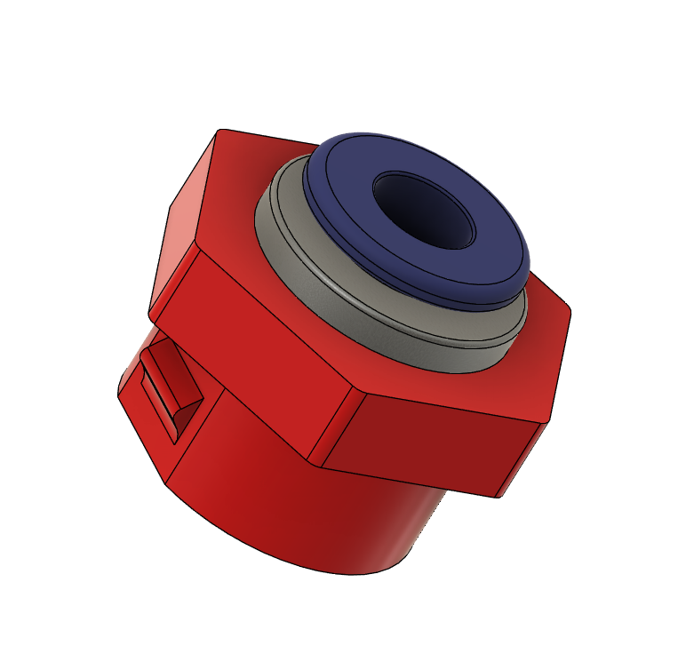

ECAS Bowden Cap

A custom version of the [Bowden Cap](/STLs/1_FlowChamber/1.3b_BowdenCap_Open.stl) designed to accomodate an ECAS coupler.
To be used for alternative cable routing through the Bowden Cap together with the [Cable Entry Cap (Closed)](/STLs/1_FlowChamber/1.4b_CableEntryCap_Closed.stl).

